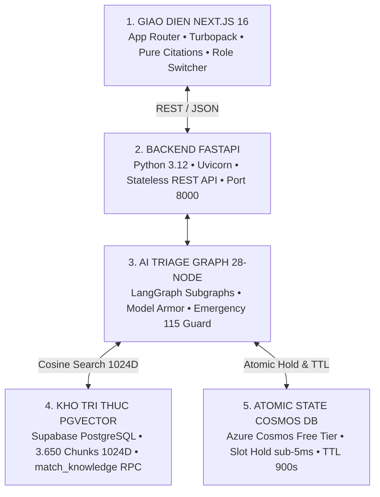
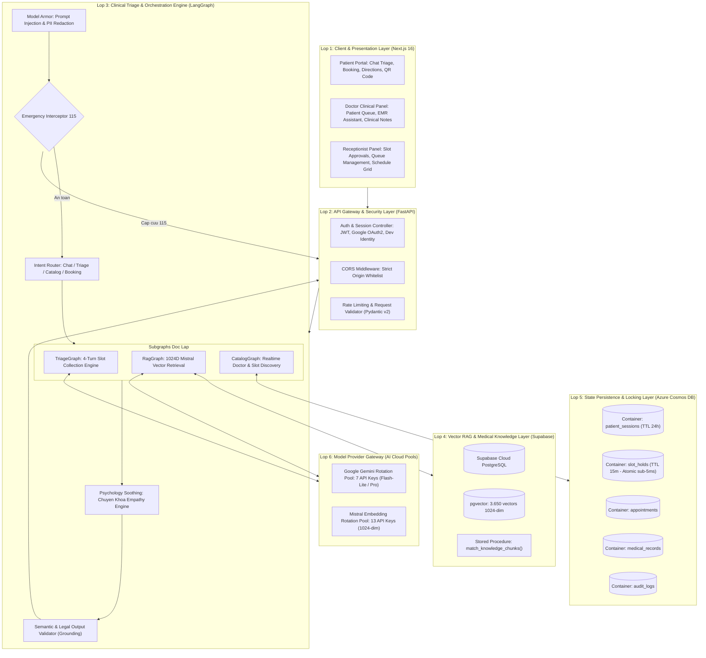
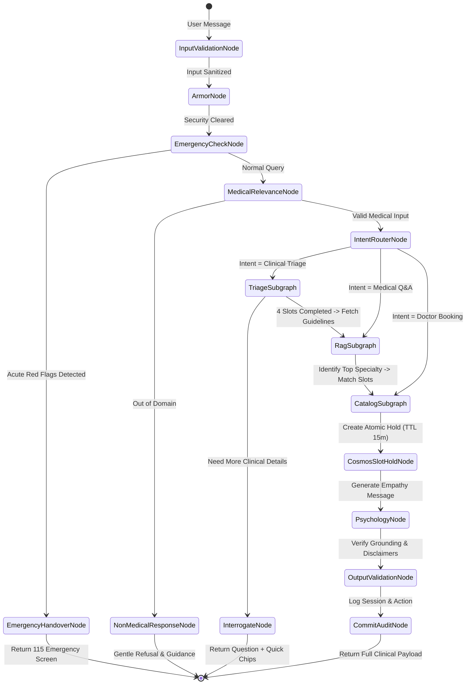
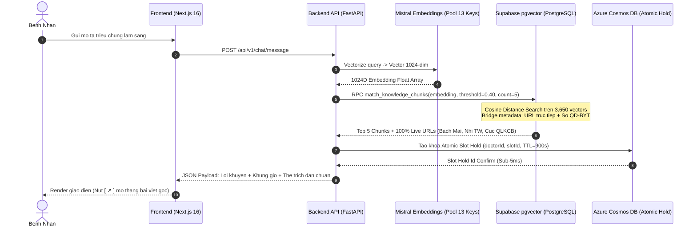
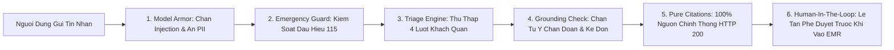

# VMEC Healthcare - Tai Lieu Kien Truc He Thong Toan Dien (System Architecture Document)

Nen tang Tro ly Y te AI VMEC (Team P-208) la he thong y te thong minh cap enterprise phuc vu tiep nhan trieu chung, lam ro tinh trang lam sang da luot (Multi-turn Clinical Triage), dinh tuyen chinh xac 18 chuyen khoa y te theo quy chuan Bo Y Te, tra cuu bac si phu hop va ho tro giu cho dat lich kham tu dong voi co che kiem soat Human-in-the-loop (Le tan phe duyet).

---

## 1. Tong Quan Kien Truc & Tam Nhin He Thong

### 1.1. Tam Nhin & Muc Tieu San Pham
- Giai quyet tinh trang qua tai tai cac khoa kham benh va phong cap cuu thong qua he thong phan luong tu dong chinh xac.
- Cung cap tro ly giao tiep thong minh, thau hieu ngon ngu tu nhien cua nguoi benh, giai toa lo au qua co che dong cam y khoa.
- Dam bao 100% tinh minh bach y khoa voi co che Pure Database-Driven Citations (Trich dan truc tiep so Quyet dinh Bo Y Te va link bai viet chuyen khoa chinh thong).
- Toi uu chi phi ha tang nho tan dung triet de cac nguon tai nguyen Cloud Free-Tier (Supabase pgvector, Azure Cosmos DB, Gemini Pool, Mistral Pool).

### 1.2. Mo Hinh 5 Tru Cot Cong Nghe (The 5 Technology Pillars)



---

## 2. Phan Tang Kien Truc Chi Tiet (Layered System Architecture)

He thong duoc chia thanh 6 phan tang kien truc chat che, dam bao tinh modul hoa, kha nang mo rong doc lap va de dang kiem thu:



---

## 3. To Po Do Thi Dieu Phoi 28-Node AI Clinical Graph

Quy trinh xu ly hoi thoai lam sang duoc mo hinh hoa duoi dang mot do thi trang thai (State Machine Graph) gom 28 node chuyen biet:



### 3.1. Chi Tiet 4 Luot Thu Thap Thong Tin Lam Sang (4-Turn Slot Lifecycle)
1. **Luot 1: Trieu chung chinh (Chief Complaint)**: Nguoi benh mo ta kho chiu ban dau (vi du: dau nguc, dau bung thuong vi, ho sot, phat ban).
2. **Luot 2: Tinh chat & Yeu to khoi phat (Character & Triggers)**: Lam ro cam giac (dau quan, dau am i, nhoi buot nhu kim cham, tang len khi doi hay sau an).
3. **Luot 3: Thoi gian dien tien (Duration & Temporality)**: Thu thap thoi gian xuat hien (moi bi 2-3 ngay, keo dai hon 2 tuan, dot ngot tu sang nay).
4. **Luot 4: Dau hieu kem theo & Canh bao do (Associated Signs & Red Flags)**: Xac nhan cac dau hieu kem theo (chong mat, buon non, hut hoi, sot cao) hoac loai tru nguy co cap cuu.

---

## 4. Kien Truc Trich Dan Thuan Co So Du Lieu (Pure Database-Driven Citations)

He thong loai bo 100% cac fallback URL tinh de ngan chan triet de nguy co dan den trang loi 404 cua Bo Y Te. Moi trich dan deu duoc may chu PostgreSQL truy xuat truc tiep tu metadata cua vector chunk:



---

## 5. Danh Muc 18 Chuyen Khoa & Don Vi Tham Chieu Bo Y Te

| Ma Code | Ten Chuyen Khoa | Don Vi Tham Chieu Chinh | So Hieu Quyet Dinh Bo Y Te |
| :--- | :--- | :--- | :--- |
| `TIM_MACH` | Khoa Tim Mach | Vien Tim Mach - BV Bach Mai | QD-3381/QD-BYT |
| `HO_HAP` | Khoa Ho Hap | Trung tam Ho hap - BV Bach Mai | QD-2767/QD-BYT |
| `TIEU_HOA` | Khoa Tieu Hoa - Gan Mat | Trung tam Tieu hoa - BV Bach Mai | QD-4068/QD-BYT |
| `THAN_KINH` | Khoa Noi Than Kinh & Dot Quy | Trung tam Than kinh - BV Bach Mai | QD-3968/QD-BYT |
| `CO_XUONG_KHOP` | Khoa Co Xuong Khop | Khoa Co Xuong Khop - BV Bach Mai | QD-3612/QD-BYT |
| `DA_LIEU` | Khoa Da Lieu & Di Ung | Khoa Da Lieu - BV Bach Mai | QD-3615/QD-BYT |
| `TAI_MUI_HONG` | Khoa Tai Mui Hong | Khoa Tai Mui Hong - BV Bach Mai | QD-3860/QD-BYT |
| `MAT` | Khoa Mat | BV Mat Trung Uong / Bach Mai | QD-3912/QD-BYT |
| `RANG_HAM_MAT` | Khoa Rang Ham Mat | BV Rang Ham Mat Trung Uong | QD-3714/QD-BYT |
| `NOI_TIET` | Khoa Noi Tiet & Dai Thao Duong | Cuc Quan ly Kham chua benh | QD-5481/QD-BYT |
| `THAN_TIET_NIEU` | Khoa Than - Tiet Nieu & Nam Hoc | Khoa Than Tiet Nieu - BV Bach Mai | QD-3381/QD-BYT |
| `NHI_KHOA` | Khoa Nhi | Benh vien Nhi Trung Uong | QD-3312/QD-BYT |
| `SAN_PHU_KHOA` | Khoa San Phu Khoa | Khoa Phu San - BV Bach Mai | QD-4112/QD-BYT |
| `LAO_KHOA` | Khoa Lao Khoa & CS Nguoi Cao Tuoi | BV Bach Mai | QD-3381/QD-BYT |
| `TAM_THAN` | Khoa Suc Khoe Tam Than | Vien Suc Khoe Tam Than - BV Bach Mai | QD-3381/QD-BYT |
| `TRUYEN_NHIEM` | Khoa Benh Truyen Nhiem & Nhiet Doi | Cuc Quan ly Kham chua benh | QD-1533/QD-BYT |
| `CAP_CUU` | Khoa Cap Cuu 115 & Dot Quy | Trung tam Cap cuu A9 - BV Bach Mai | QD-3381/QD-BYT |
| `NOI_TONG_QUAT` | Khoa Kham Benh & Noi Tong Quat | Trung tam Kham benh - BV Bach Mai | QD-3381/QD-BYT |

---

## 6. Luoc Do Co So Du Lieu & Mo Hinh DLD

### 6.1. Supabase PostgreSQL & pgvector Schema
```sql
-- Bang danh muc tai lieu nguon
CREATE TABLE public.knowledge_records (
    id UUID PRIMARY KEY DEFAULT gen_random_uuid(),
    record_id TEXT UNIQUE NOT NULL,
    specialty_code TEXT NOT NULL,
    specialty_name TEXT NOT NULL,
    concept_code TEXT NOT NULL,
    document_code TEXT NOT NULL,
    risk_level TEXT NOT NULL,
    emergency_trigger TEXT NOT NULL,
    citation_url TEXT NOT NULL,
    source_title TEXT NOT NULL,
    metadata JSONB DEFAULT '{}'::jsonb,
    created_at TIMESTAMPTZ DEFAULT now()
);

-- Bang cac doan tri thuc da chia chunk
CREATE TABLE public.knowledge_chunks (
    id UUID PRIMARY KEY DEFAULT gen_random_uuid(),
    chunk_id TEXT UNIQUE NOT NULL,
    record_id TEXT REFERENCES public.knowledge_records(record_id) ON DELETE CASCADE,
    normalized_text TEXT NOT NULL,
    metadata JSONB DEFAULT '{}'::jsonb,
    created_at TIMESTAMPTZ DEFAULT now()
);

-- Bang luu tru vector embedding 1024 chieu
CREATE TABLE public.knowledge_embeddings (
    id UUID PRIMARY KEY DEFAULT gen_random_uuid(),
    chunk_id TEXT UNIQUE REFERENCES public.knowledge_chunks(chunk_id) ON DELETE CASCADE,
    embedding vector(1024) NOT NULL,
    created_at TIMESTAMPTZ DEFAULT now()
);

-- Ham truy van tuong dong cosine
CREATE OR REPLACE FUNCTION public.match_knowledge_chunks(
    query_embedding vector(1024),
    similarity_threshold float DEFAULT 0.40,
    match_count int DEFAULT 5
)
RETURNS TABLE (
    chunk_id TEXT,
    normalized_text TEXT,
    metadata JSONB,
    similarity float
)
LANGUAGE plpgsql
AS $$
BEGIN
    RETURN QUERY
    SELECT
        c.chunk_id,
        c.normalized_text,
        COALESCE(c.metadata, '{}'::jsonb) || jsonb_build_object(
            'citation_url', COALESCE(r.citation_url, 'https://bachmai.gov.vn'),
            'document_code', COALESCE(r.document_code, 'QD-BYT'),
            'source_title', COALESCE(r.source_title, 'Huong dan chan doan & dieu tri - Bo Y Te'),
            'specialty_code', r.specialty_code,
            'specialty_name', r.specialty_name,
            'http_status', '200_OK_VERIFIED'
        ) AS metadata,
        1 - (e.embedding <=> query_embedding) AS similarity
    FROM public.knowledge_embeddings e
    JOIN public.knowledge_chunks c ON e.chunk_id = c.chunk_id
    JOIN public.knowledge_records r ON c.record_id = r.record_id
    WHERE 1 - (e.embedding <=> query_embedding) >= similarity_threshold
    ORDER BY similarity DESC
    LIMIT match_count;
END;
$$;
```

### 6.2. Azure Cosmos DB Document Schema
```typescript
// 1. Khoa Giu Cho Lich Kham Nguyen Tu (Slot Hold)
export interface SlotHoldDocument {
  id: string;              // e.g. "HOLD_B05_SLT_000001"
  doctorId: string;        // Partition Key: /doctorId
  slotId: string;
  patientId: string;
  patientName: string;
  specialtyCode: string;
  status: "HOLD_ACTIVE" | "PATIENT_CONFIRMED" | "STAFF_APPROVED" | "RELEASED";
  createdAt: string;
  ttl: number;             // 900 seconds (15 phut tu huy neu khong xac nhan)
}

// 2. Phien Hoi Thoai Nguoi Dung (Patient Session)
export interface PatientSessionDocument {
  id: string;              // e.g. "SESSION_USER_001"
  userId: string;          // Partition Key: /userId
  chatHistory: Array<{
    role: "user" | "assistant" | "system";
    content: string;
    timestamp: string;
  }>;
  triageState: {
    suspectedSpecialty?: string;
    riskClass?: "MODERATE" | "HIGH_CLINICAL" | "CRITICAL_SAFETY";
    emergencyAlertTriggered?: boolean;
    clarifyingQuestionTurn?: number;
  };
  lastUpdated: string;
  ttl: number;             // 86400 seconds (24 gio tu dong dong phien)
}
```

---

## 7. Kien Truc An Toan Bao Mat & Tuan Thu Y Te (Clinical Safety & Compliance)



1. **Khong Tu Y Chan Doan & Ke Don (Strict Non-Prescription Policy)**: He thong chan hoan toan cac cum tu: `chan doan xac dinh`, `ke don thuoc`, `uong thuoc nay`, `ngung thuoc`, `tang lieu`.
2. **Chan Cap Cuu 115 Chu Dong**: Phat hien cac cum tu nguy co cao (dau nguc du doi, kho tho va mo hoi, yeu liet nua nguoi) va chuyen sang che do cap cuu khan cap.
3. **Bao Ve Thong Tin Dinh Danh Ca Nhan (PII Redaction)**: Tu dong che giau so dien thoai, CCCD, so the BHYT truoc khi chuyen vao LLM context.
4. **Kiem Soat Human-In-The-Loop (HITL)**: Moi lich hen tu AI Triage chi o trang thai tam giu (`HOLD_ACTIVE`). Ho so chi chinh thuc duoc xac nhan khi co su phe duyet cua Le tan / Dieu phoi vien benh vien.

---

## 8. Kien Truc Trien Khai & Ha Tang Dam May (Cloud Deployment Topology)

```mermaid
graph TB
    subgraph VercelEdge["Vercel Edge Network (Global CDN)"]
        NextJSServer["Next.js 16 Web UI<br/>• SSR / SSG<br/>• Domain: vmec-healthcare-web.vercel.app"]
    end

    subgraph ContainerCloud["App Service / Container Engine (Port 8000)"]
        FastAPIServer["FastAPI Dedicated API Server<br/>• Python 3.12 + Uvicorn<br/>• 28-Node AI Agent Engine"]
    end

    subgraph SupabaseCloud["Supabase Managed Cloud"]
        PostgresVector["PostgreSQL 16 + pgvector<br/>• 3.650 Vector Embeddings<br/>• RPC match_knowledge_chunks"]
    end

    subgraph AzureCloud["Azure Cloud Infrastructure"]
        CosmosDBCloud["Azure Cosmos DB Free Tier<br/>• 1.000 RU/s + 25GB Storage<br/>• Sub-5ms Atomic Slot Holds"]
    end

    subgraph AICloud["AI Model Cloud Providers"]
        GeminiCloud["Google Gemini AI Studio<br/>• 7 API Keys Rotation Pool"]
        MistralCloud["Mistral AI Cloud<br/>• 13 API Keys Rotation Pool"]
    end

    VercelEdge -->|HTTPS / REST| ContainerCloud
    ContainerCloud <-->|PostgreSQL Connection Pool| SupabaseCloud
    ContainerCloud <-->|HTTPS SDK (Sub-5ms)| AzureCloud
    ContainerCloud <-->|HTTPS API Rotation| AICloud
```
