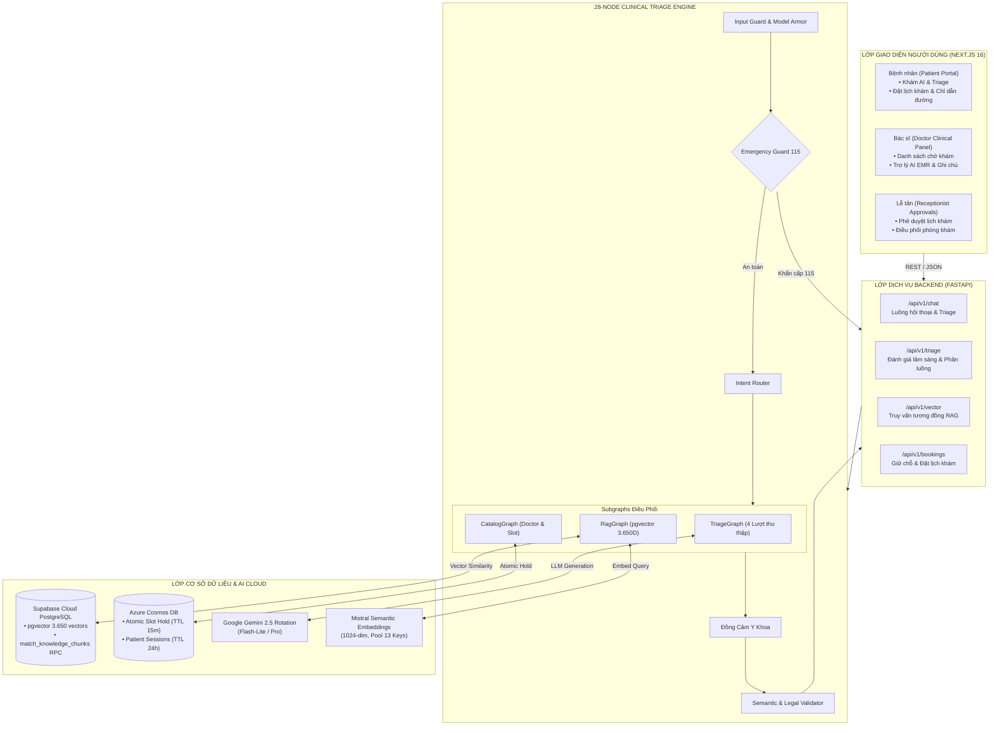
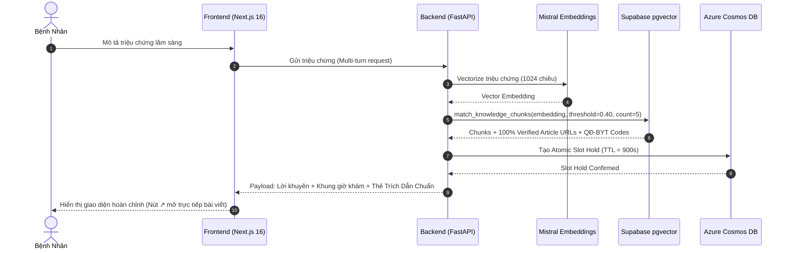

# Kiến Trúc Hệ Thống VMEC Healthcare AI Agent Platform

## 1. Tổng Quan Hệ Thống (System Overview)

VMEC Healthcare (Team P-208) là nền tảng Trợ lý Y tế AI toàn diện hỗ trợ tiếp nhận triệu chứng, làm rõ tình trạng đa lượt (Multi-turn Triage), điều hướng chính xác 18 chuyên khoa lâm sàng, tra cứu bác sĩ và đặt lịch khám tự động với cơ chế kiểm soát Human-in-the-loop (Lễ tân duyệt).

### Ngũ Trụ Công Nghệ Cốt Lõi:
1. **Frontend**: Next.js 16 (App Router, Turbopack, Tailwind CSS, Pure Database-Driven Citations, Realtime Role Switcher: Patient / Doctor / Receptionist).
2. **Backend**: FastAPI (Python 3.12, Uvicorn, Pydantic v2 Settings, Stateless Orchestration).
3. **AI Triage Engine**: 28-Node Clinical Graph với 3 Subgraphs (`TriageGraph`, `RagGraph`, `CatalogGraph`), tích hợp cơ chế Guardrails an toàn y tế và đồng cảm tâm lý lâm sàng.
4. **Knowledge Base & Vector RAG**: Supabase Cloud PostgreSQL + `pgvector` (3.650 vectors 1024-chiều chuẩn hóa Bộ Y Tế, RPC `match_knowledge_chunks` trích xuất trực tiếp bài viết bệnh viện và số Quyết định).
5. **State & Slot Hold Engine**: Azure Cosmos DB Free Tier (Atomic Slot Holding sub-5ms, TTL 900s tự hủy, Session TTL 24h).

---

## 2. Sơ Đồ Kiến Trúc Tổng Thể (System Architecture Diagram)

---

## 3. Quy Trình Trích Dẫn Dữ Liệu Thuần Database (Pure Database-Driven Citations)

---

## 4. Danh Mục 18 Chuyên Khoa Lâm Sàng Chuẩn Hóa

1. `TIM_MACH`: Khoa Tim Mạch (Viện Tim Mạch - BV Bạch Mai)
2. `HO_HAP`: Khoa Hô Hấp (Trung tâm Hô hấp - BV Bạch Mai)
3. `TIEU_HOA`: Khoa Tiêu Hóa - Gan Mật (Trung tâm Tiêu hóa - BV Bạch Mai)
4. `THAN_KINH`: Khoa Nội Thần Kinh & Đột Quỵ (Trung tâm Thần kinh - BV Bạch Mai)
5. `CO_XUONG_KHOP`: Khoa Cơ Xương Khớp (BV Bạch Mai)
6. `DA_LIEU`: Khoa Da Liễu & Dị Ứng Miễn Dịch (BV Bạch Mai)
7. `TAI_MUI_HONG`: Khoa Tai Mũi Họng (BV Bạch Mai)
8. `MAT`: Khoa Mắt
9. `RANG_HAM_MAT`: Khoa Răng Hàm Mặt
10. `NOI_TIET`: Khoa Nội Tiết & Đái Tháo Đường (Cục QLKCB)
11. `THAN_TIET_NIEU`: Khoa Thận - Tiết Niệu & Nam Học
12. `NHI_KHOA`: Khoa Nhi (Bệnh viện Nhi Trung Ương)
13. `SAN_PHU_KHOA`: Khoa Sản Phụ Khoa (BV Bạch Mai)
14. `LAO_KHOA`: Khoa Lão Khoa & Chăm Sóc Người Cao Tuổi
15. `TAM_THAN`: Khoa Sức Khỏe Tâm Thần & Trị Liệu Tâm Lý
16. `TRUYEN_NHIEM`: Khoa Bệnh Truyền Nhiễm & Nhiệt Đới (Cục QLKCB)
17. `CAP_CUU`: Khoa Cấp Cứu 115 & Đột Quỵ Khẩn Cấp
18. `NOI_TONG_QUAT`: Khoa Khám Bệnh & Tầm Soát Sức Khỏe Toàn Diện
