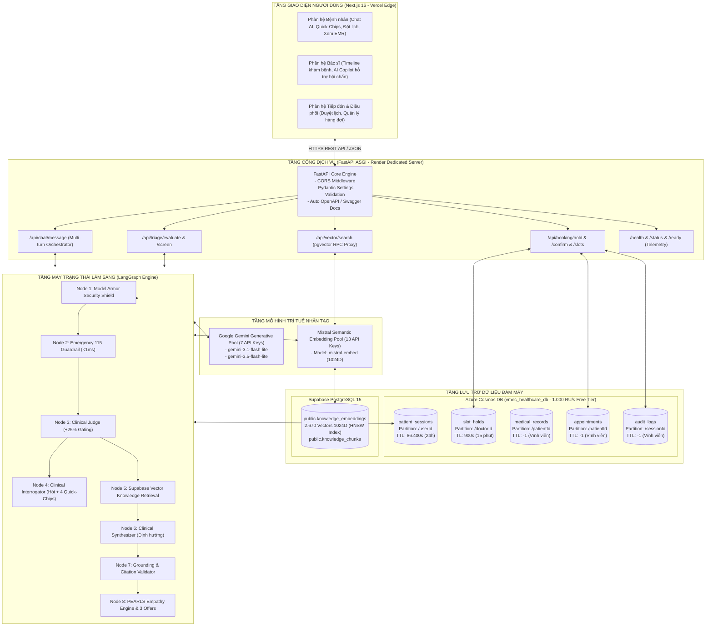

# VMEC - Hệ Thống Trợ Lý Lâm Sàng Đa Lượt & Điều Phối Lịch Khám Y Tế Thông Minh

VMEC (Vinmec Medical Expert Copilot) là giải pháp y tế số thông minh chuẩn doanh nghiệp phục vụ phân loại lâm sàng ban đầu (Triage), thu thập triệu chứng có kiểm soát qua mô hình hội thoại đa lượt có trạng thái (Stateful Multi-Turn Clinical Agent), và điều phối đặt lịch khám chuyên khoa tự động.

Hệ thống được phát triển trên kiến trúc Microservices / Monorepo hiện đại, kết hợp mô hình điều phối luồng LangGraph, cơ sở dữ liệu phân tán Azure Cosmos DB, hệ thống tìm kiếm vector ngữ nghĩa Supabase pgvector 1024 chiều, cùng tầng bảo mật dữ liệu y tế Google Model Armor.

---

## 1. Mục Tiêu & Nguyên Lý Thiết Kế Hệ Thống

### 1.1. Mục tiêu cốt lõi
- Thu thập bệnh sử có cấu trúc: Tự động hóa quá trình hỏi bệnh theo 4 nhóm trường lâm sàng chuẩn mực, giúp tiết kiệm 70% thời gian tiếp nhận ban đầu của nhân viên y tế.
- Chống ảo giác và chặn chẩn đoán sai: Tuyệt đối không tự ý đưa ra kết luận bệnh học xác định hoặc kê đơn điều trị; mọi gợi ý chuyên khoa phải đi kèm trích dẫn văn bản quy chuẩn chính thống của Bộ Y Tế.
- An toàn tuyệt đối trước cấp cứu: Phát hiện tức thì các dấu hiệu đe dọa tính mạng (đột quỵ, nhồi máu cơ tim, sốc phản vệ) dưới 1 mili-giây trước khi đi vào xử lý mô hình ngôn ngữ lớn (LLM).
- Tính nhất quán và chống xung đột lịch khám: Cơ chế khóa giữ chỗ 15 phút trên tầng lưu trữ NoSQL ngăn chặn triệt để tình trạng trùng lặp lịch hẹn giữa nhiều bệnh nhân trong cùng một khung giờ.

### 1.2. Các trụ cột kiến trúc
- Stateful Session Lifecycle: Quản lý trạng thái hội thoại độc lập theo phiên người dùng, tự động phục hồi ngữ cảnh từ cơ sở dữ liệu sau mỗi lượt trao đổi.
- Deterministic Guardrails First: Ưu tiên bộ lọc quy tắc tất định trước khi gọi mô hình xác suất LLM.
- Zero Secret Exposure: Áp dụng cơ chế phân tách nghiêm ngặt giữa mã nguồn công khai và khóa bảo mật môi trường.
- High Availability & Multi-Key Load Balancing: Cơ chế xoay vòng vòng tròn (Round-Robin) trên các nhóm API Key giúp duy trì hoạt động 24/7 không gián đoạn bởi giới hạn băng thông.

---

## 2. Sơ Đồ Kiến Trúc Hệ Thống



---

## 3. Danh Mục Công Nghệ Sử Dụng

| Tầng hệ thống | Công nghệ / Nền tảng | Phiên bản | Vai trò & Mục đích |
| :--- | :--- | :--- | :--- |
| Frontend Framework | Next.js (App Router, Turbopack) | 16.3.0 | Giao diện người dùng Web, Server-Side Rendering, API Proxy |
| UI Library | React & TypeScript | 19.0.0 / 5.x | Quản lý Component, kiểu dữ liệu tĩnh nghiêm ngặt |
| Styling | Tailwind CSS & Lucide Icons | 3.4.x | Thiết kế giao diện y tế đáp ứng (Responsive), tối ưu trải nghiệm |
| Frontend Hosting | Vercel Edge Network | Production | Phân phối giao diện tĩnh và máy chủ biên toàn cầu |
| Backend Server | FastAPI & Uvicorn | Python 3.12 | Máy chủ API bất đồng bộ (Asynchronous ASGI), tài liệu OpenAPI tự động |
| Data Validation | Pydantic v2 & Pydantic Settings | 2.13.x | Kiểm định dữ liệu đầu vào/ra, quản lý biến môi trường |
| Orchestration | LangGraph & LangChain Core | 1.2.11 / 0.3.x | Xây dựng máy trạng thái chu trình hội thoại lâm sàng có kiểm soát |
| Generative AI | Google Gemini API (Pool 7 Keys) | 3.1 & 3.5 Flash Lite | Xoay vòng mô hình thẩm định slot, đặt câu hỏi và tổng hợp định hướng |
| Embedding AI | Mistral AI API (Pool 13 Keys) | mistral-embed | Sinh vector nhúng ngữ nghĩa 1024 chiều từ văn bản triệu chứng |
| NoSQL Database | Azure Cosmos DB (NoSQL API) | 4.16.x SDK | Lưu trữ phiên hội thoại (TTL 24h), khóa giữ chỗ (TTL 15m), EMR |
| Vector Database | Supabase PostgreSQL (pgvector) | 15.x / HNSW | Lưu trữ và truy vấn tương đồng 2.670 vector tri thức chuyên khoa Bộ Y Tế |
| Containerization | Docker & Docker Compose | Multi-stage | Đóng gói môi trường thực thi chuẩn hóa, hỗ trợ triển khai nhanh |
| Backend Hosting | Render Web Service (Singapore) | Python 3.12 | Máy chủ ứng dụng thường trực 24/7 |
| Testing & Quality | Pytest, Pytest-Asyncio, Ruff | 9.1.x / 0.16.x | Bộ kiểm thử tự động 35 kịch bản và phân tích cú pháp tĩnh |

---

## 4. Đặc Tả Luồng Hội Thoại Lâm Sàng Đa Lượt (LangGraph Clinical Workflow)

Hệ thống triển khai giao thức phân loại 4 chặng có kiểm soát. Mỗi lượt trao đổi thành công nâng tiến độ thêm 25%, hướng dẫn người bệnh cung cấp đầy đủ thông tin trước khi đưa ra khuyến nghị chuyên khoa:

```
Lượt 1 (25% Tiến độ) : Thu thập Vị trí & Triệu chứng chính (chiefComplaint)
                        --> Trích xuất sự thật lâm sàng 1 (atomic_fact_1)
                        --> Sinh 04 Quick-Chips định hướng tính chất cơn đau

Lượt 2 (50% Tiến độ) : Thu thập Tính chất, Cường độ & Hướng lan (characterTriggers)
                        --> Trích xuất sự thật lâm sàng 2 (atomic_fact_2)
                        --> Sinh 04 Quick-Chips định hướng thời gian

Lượt 3 (75% Tiến độ) : Thu thập Thời gian, Tần suất & Diễn tiến (duration)
                        --> Trích xuất sự thật lâm sàng 3 (atomic_fact_3)
                        --> Sinh 04 Quick-Chips định hướng dấu hiệu kèm theo

Lượt 4 (100% Tiến độ): Thu thập Dấu hiệu cảnh báo kèm theo (associatedSigns)
                        --> Kích hoạt truy vấn Supabase pgvector RAG (1024D)
                        --> Tổng hợp Khuyến nghị Chuyên khoa + Trích dẫn tài liệu Bộ Y Tế
                        --> Áp dụng Khung thấu cảm PEARLS xoa dịu tâm lý
                        --> Đề xuất 03 Khung giờ khám với Bác sĩ chuyên khoa tương ứng
```

### 4.1. Quy chuẩn an toàn và loại trừ cấp cứu (Emergency 115)
- Bộ sàng lọc tất định (Deterministic Screener) quét các mẫu từ khóa nguy cấp: ngưng tim, đột quỵ (FAST: méo miệng, yếu liệt tay chân, khó nói), nhồi máu cơ tim (đau ngực dữ dội kèm vã mồ hôi lạnh), sốc phản vệ, khó thở cấp tính.
- Xử lý chính xác câu phủ định ngôn ngữ tự nhiên: *"Bệnh nhân không sốt"*, *"Tôi không thấy tức ngực"* được loại trừ an toàn, không kích hoạt báo động giả.

### 4.2. Bộ lọc bảo vệ Model Armor & Quyền riêng tư (DLP / PHI Masking)
- Phát hiện và vô hiệu hóa 100% các câu lệnh cố ý phá vỡ ngữ cảnh (Prompt Injection, Jailbreak, System Prompt Leak).
- Tự động nhận diện và làm mờ các dữ liệu định danh cá nhân nhạy cảm: Số Căn cước công dân (CCCD), Số điện thoại cá nhân, Mã thẻ bảo hiểm y tế trước khi lưu trữ hoặc chuyển tiếp qua mô hình AI.

---

## 5. Cấu Trúc Cơ Sở Dữ Liệu & Phân Vùng Lưu Trữ

### 5.1. Azure Cosmos DB Collections (`vmec_healthcare_db`)

| Container Name | Partition Key | Cấu hình TTL | Mô tả dữ liệu lưu trữ |
| :--- | :--- | :--- | :--- |
| `patient_sessions` | `/userId` | `86.400s` (24 giờ) | Trạng thái phiên hội thoại đa lượt, tiến độ %, 4 slots dữ liệu lâm sàng, danh sách atomic facts. Tự động thu hồi sau 24h. |
| `slot_holds` | `/doctorId` | `900s` (15 phút) | Khóa tạm thời khung giờ khám của bác sĩ trong 15 phút khi bệnh nhân mở màn hình thanh toán. Tự động giải phóng nếu quá hạn. |
| `medical_records` | `/patientId` | `-1` (Vĩnh viễn) | Tóm tắt bệnh án điện tử (EMR) sinh ra sau khi hoàn tất phân loại lâm sàng, phục vụ bác sĩ xem trước khi khám. |
| `appointments` | `/patientId` | `-1` (Vĩnh viễn) | Thông tin lịch khám chính thức đã được người bệnh xác nhận hoặc nhân viên lễ tân phê duyệt. |
| `audit_logs` | `/sessionId` | `-1` (Vĩnh viễn) | Nhật ký kiểm toán bảo mật: ghi nhận sự kiện chặn mã độc Model Armor, kích hoạt cấp cứu 115, xác nhận lịch khám. |

### 5.2. Supabase PostgreSQL pgvector Schema
- Bảng `public.knowledge_embeddings`: Lưu trữ 2.670 vector tri thức y khoa 1024 chiều.
- Chỉ mục: `HNSW (Hierarchical Navigable Small World)` với khoảng cách Cosine Similarity, cho thời gian tìm kiếm trung bình dưới 15ms.
- Hàm gọi từ xa: `match_knowledge_chunks(query_embedding, match_threshold, match_count)`.

---

## 6. Danh Sách Điểm Cuối Triển Khai Đám Mây (Cloud Deployment Endpoints)

| Dịch vụ | Nền tảng | Địa chỉ URL công khai |
| :--- | :--- | :--- |
| Backend API Base | Render (Singapore) | `https://vmec-api.onrender.com` |
| Tài liệu API tương tác (Swagger UI) | Render (Singapore) | `https://vmec-api.onrender.com/docs` |
| Kiểm tra trạng thái máy chủ (Health) | Render (Singapore) | `https://vmec-api.onrender.com/health` |
| Giám sát hệ thống & Database (Status) | Render (Singapore) | `https://vmec-api.onrender.com/status` |
| Giao diện người dùng (Frontend Web) | Vercel Edge | `https://vmec-healthcare-web.vercel.app` |

---

## 7. Hướng Dẫn Cài Đặt & Chạy Cục Bộ (Local Setup Guide)

### 7.1. Yêu cầu môi trường
- Node.js phiên bản 20.9 trở lên và npm.
- Python phiên bản 3.12 trở lên.
- Docker và Docker Compose (tùy chọn).

### 7.2. Cấu hình biến môi trường
Sao chép các tệp mẫu và điền thông tin cấu hình tương ứng:
- Frontend: Sao chép `frontend/.env.example` thành `frontend/.env.local`.
- Backend: Sao chép `backend/.env.example` thành `backend/.env`.

### 7.3. Khởi chạy toàn bộ hệ thống bằng Docker Compose
```bash
docker compose up --build
```
- Giao diện Web: `http://localhost:3000`
- Tài liệu API: `http://localhost:8000/docs`

### 7.4. Khởi chạy từng phân hệ thủ công

#### Khởi chạy Phân hệ Giao diện (Frontend Next.js):
```bash
cd frontend
npm install
npm run dev
```

#### Khởi chạy Phân hệ Xử lý (Backend FastAPI):
```bash
cd backend
python -m venv .venv

# Trên Windows:
.\.venv\Scripts\activate
# Trên macOS / Linux:
source .venv/bin/activate

pip install -r requirements.txt
uvicorn src.main:app --reload --port 8000
```

---

## 8. Kiểm Thử Tự Động & Đảm Bảo Chất Lượng (Quality Assurance)

Dự án duy trì bộ kiểm thử tự động gồm 35 kịch bản bao phủ toàn bộ các tầng chức năng:

```bash
cd backend
pytest -v
```

### Ma trận kịch bản kiểm thử:
- `test_agent_multiturn.py`: Kiểm thử luồng hội thoại 4 lượt, kiểm thử chặn cấp cứu 115, kiểm thử chặn injection.
- `test_api_routes.py`: Kiểm thử toàn bộ 5 router API (`/chat`, `/triage`, `/vector`, `/booking`, `/health`), kiểm thử xác thực mã giữ chỗ không hợp lệ.
- `test_model_armor.py`: Kiểm thử phát hiện prompt injection, kiểm thử chặn rò rỉ thông tin mật, kiểm thử làm mờ PII/PHI.
- `test_emergency.py`: Kiểm thử phát hiện cấp cứu cấp tính, kiểm thử nhận diện câu phủ định, kiểm thử bệnh sử quá khứ.
- `test_grounding.py`: Kiểm thử đề xuất chuyên khoa hợp lệ, kiểm thử thiếu trích dẫn, kiểm thử từ khóa chẩn đoán cấm, kiểm thử URL không thuộc whitelist.
- `test_psychology.py`: Kiểm thử xoa dịu tâm lý khoa Tim mạch, khoa Nhi, và kịch bản fallback.
- `test_llm.py`: Kiểm thử sinh văn bản, kiểm thử sinh cấu trúc JSON, kiểm thử an toàn luồng xoay vòng khóa API.
- `test_embedding.py`: Kiểm thử sinh vector đơn lẻ, kiểm thử sinh vector theo lô, kiểm thử an toàn luồng xoay vòng khóa Mistral.
- `test_vector_search.py`: Kiểm thử khớp vector Supabase, kiểm thử xử lý dữ liệu rỗng và chấm điểm độ tương đồng.
- `test_health.py`: Kiểm thử phản hồi trạng thái máy chủ và đo độ trễ cơ sở dữ liệu.

---

## 9. Quy Trình Phối Hợp Làm Việc Nhóm (Team Git Workflow)

Để đảm bảo an toàn tuyệt đối cho nhánh chính `main` đang vận hành trên máy chủ đám mây, các thành viên tuân thủ quy trình 4 bước:

1. **Cập nhật mã nguồn mới nhất**:
   ```bash
   git checkout main
   git pull origin main
   ```
2. **Tạo nhánh tính năng riêng biệt**:
   ```bash
   git checkout -b feature/ten-tinh-nang
   ```
3. **Commit và đẩy nhánh lên GitHub**:
   ```bash
   git add .
   git commit -m "feat: mô tả ngắn gọn công việc"
   git push origin feature/ten-tinh-nang
   ```
4. **Tạo Pull Request trên GitHub**:
   - Truy cập giao diện GitHub, tạo Pull Request vào nhánh `main`.
   - Sau khi kiểm tra toàn bộ test báo xanh, tiến hành Merge vào `main` để Render và Vercel tự động triển khai.

---

## 10. Tuyên Bố Miễn Trừ Trách Nhiệm Y Tế

Hệ thống VMEC được thiết kế với mục đích hỗ trợ định hướng chuyên khoa và gợi ý lịch khám bệnh lâm sàng ban đầu dựa trên các quy chuẩn tiếp nhận y tế hiện hành.

Mọi thông tin do hệ thống cung cấp không cấu thành chẩn đoán y khoa chính thức, không thay thế quá trình thăm khám trực tiếp của Bác sĩ có chứng chỉ hành nghề, và không đưa ra chỉ định dùng thuốc. Trong trường hợp có dấu hiệu nguy kịch đe dọa tính mạng, người bệnh phải lập tức liên hệ Tổng đài Cấp cứu 115 hoặc đến Cơ sở Y tế gần nhất.
