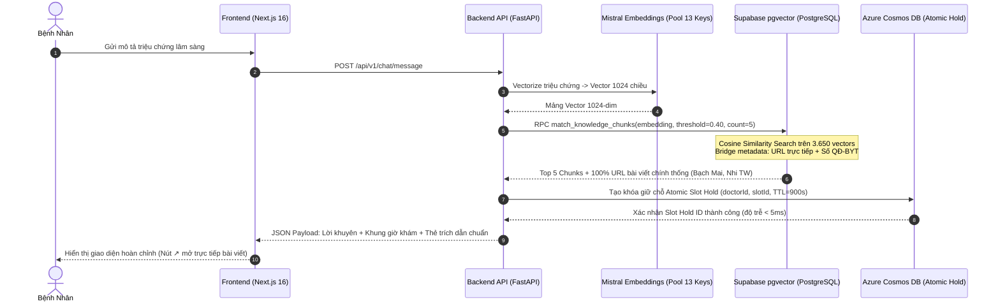

# VMEC Healthcare - Nền Tảng Trợ Lý Y Tế AI Điều Hướng Chuyên Khoa & Đặt Lịch Khám

VMEC Healthcare (Team P-208) là nền tảng Trợ lý Y tế AI toàn diện phục vụ tiếp nhận triệu chứng, làm rõ tình trạng lâm sàng đa lượt (Multi-turn Clinical Triage), định tuyến chính xác 18 chuyên khoa lâm sàng theo quy chuẩn Bộ Y Tế, tra cứu bác sĩ phù hợp và hỗ trợ giữ chỗ đặt lịch khám tự động với cơ chế kiểm soát Human-in-the-loop (Lễ tân phê duyệt).

---

## 1. Tổng Quan Kiến Trúc & 5 Trụ Cột Công Nghệ

Hệ thống được thiết kế dựa trên 5 trụ cột công nghệ hiện đại, đảm bảo tính sẵn sàng cao, độ trễ thấp, an toàn bảo mật thông tin y tế và minh bạch nguồn gốc tri thức:

### 1.1. Giao Diện Người Dùng Web (Next.js 16)
- Xây dựng trên nền tảng Next.js 16 với kiến trúc App Router, Turbopack engine và Tailwind CSS.
- Tích hợp hệ thống trích dẫn thuần cơ sở dữ liệu (Pure Database-Driven Citations), kết nối trực tiếp vào các bài viết lâm sàng chính thống hoạt động thực tế (HTTP 200 OK) và số hiệu Quyết định Bộ Y Tế.
- Cung cấp bộ chuyển đổi vai trò trải nghiệm tức thì (Role Switcher) gồm 3 phân hệ:
  + Bệnh nhân (Patient Portal): Hội thoại AI, nhận định tuyến chuyên khoa, giữ chỗ lịch khám, xem chỉ dẫn đường và quản lý mã QR / Sổ bệnh án điện tử.
  + Bác sĩ (Doctor Clinical Panel): Xem hàng đợi bệnh nhân thời gian thực, tổng hợp bệnh án điện tử (EMR) do AI khởi tạo và ghi chú kết luận khám.
  + Lễ tân / Điều phối viên (Receptionist Approvals): Phê duyệt hoặc điều chỉnh các yêu cầu giữ chỗ tự động, giảm tải ùn tắc phòng khám.

### 1.2. Backend Dedicated API (FastAPI)
- Phát triển trên Python 3.12 với framework FastAPI, Uvicorn ASGI server và Pydantic v2 Settings.
- Kiến trúc Stateless Microservices phục vụ tại cổng 8000, hỗ trợ đầy đủ OpenAPI / Swagger docs, CORS đa nguồn và cơ chế xử lý lỗi tập trung.

### 1.3. AI Clinical Triage Engine (28-Node Graph)
- Hệ thống điều phối hội thoại lâm sàng 28-node gồm 3 subgraphs độc lập:
  + TriageGraph: Thu thập 4 slot lâm sàng (Triệu chứng chính, Tính chất / Khởi phát, Thời gian diễn tiến, Dấu hiệu cảnh báo).
  + RagGraph: Truy vấn tương đồng tri thức y tế 1024-chiều qua pgvector.
  + CatalogGraph: Tra cứu bác sĩ và lịch trống theo thời gian thực.
- Tích hợp bộ lọc an toàn Model Armor (phát hiện Prompt Injection, rò rỉ PII / Credentials) và bộ chặn cấp cứu chủ động Emergency Guard 115.

### 1.4. Cơ Sở Dữ Liệu Tri Thức & Vector RAG (Supabase pgvector)
- Sử dụng Supabase Cloud PostgreSQL tích hợp extension pgvector.
- Lưu trữ 3.650 vector tri thức y tế 1024-chiều được chuẩn hóa từ phác đồ Bộ Y Tế qua Mistral Embeddings.
- Hàm lưu trữ RPC `public.match_knowledge_chunks` thực hiện cosine similarity search và tự động làm giàu metadata bài viết thực tế.

### 1.5. Atomic State & Slot Holding Engine (Azure Cosmos DB Free Tier)
- Sử dụng Azure Cosmos DB (1.000 RU/s + 25GB Storage miễn phí trọn đời).
- Hỗ trợ tạo khóa giữ chỗ lịch khám nguyên tử (Atomic Slot Hold) với độ trễ dưới 5ms và cơ chế tự hủy sau 15 phút (TTL = 900s).
- Lưu trữ phiên hội thoại người dùng với cơ chế tự động hết hạn sau 24 giờ (TTL = 86400s).

---

## 2. Sơ Đồ Kiến Trúc Tổng Thể & Luồng Dữ Liệu

### 2.1. Sơ Đồ Phân Tầng Kiến Trúc Hệ Thống (System Architecture Diagram)

```mermaid
graph TB
    subgraph ClientLayer["LỚP GIAO DIỆN NGƯỜI DÙNG (NEXT.JS 16)"]
        PatientPortal["Bệnh Nhân (Patient Portal)<br/>• AI Chat & Triage đa lượt<br/>• Đặt lịch khám & Chỉ dẫn đường<br/>• Quản lý QR Code & Hồ sơ"]
        DoctorPanel["Bác Sĩ (Doctor Clinical Panel)<br/>• Danh sách hàng đợi khám<br/>• Trợ lý AI tóm tắt EMR<br/>• Ghi chú kết luận lâm sàng"]
        StaffPanel["Lễ Tân (Receptionist Approvals)<br/>• Phê duyệt yêu cầu đặt lịch<br/>• Điều phối lịch khám thời gian thực<br/>• Quản lý danh mục chuyên khoa"]
    end

    subgraph APILayer["LỚP DỊCH VỤ BACKEND (FASTAPI - PORT 8000)"]
        ChatAPI["/api/v1/chat/message<br/>Hội thoại & Triage AI"]
        TriageAPI["/api/v1/triage/evaluate<br/>Đánh giá & Định tuyến chuyên khoa"]
        VectorAPI["/api/v1/vector/search<br/>Truy vấn tương đồng RAG"]
        BookingAPI["/api/v1/bookings/hold<br/>Khóa giữ chỗ & Đặt lịch"]
    end

    subgraph EngineLayer["28-NODE CLINICAL TRIAGE ENGINE (LANGGRAPH)"]
        ModelArmor["Model Armor<br/>• Chặn Prompt Injection<br/>• Ẩn thông tin cá nhân PII"]
        EmergencyCheck{"Emergency Guard 115<br/>Phát hiện cấp cứu khẩn cấp?"}
        EmergencyScreen["Giao Diện Cấp Cứu 115<br/>Hướng dẫn xử trí tức thì"]
        IntentRouter["Intent Router<br/>Phân luồng ý định người dùng"]

        subgraph Subgraphs["Các Đồ Thị Con (Subgraphs)"]
            TriageSub["TriageGraph<br/>Thu thập 4 slot lâm sàng"]
            RagSub["RagGraph<br/>Truy vấn 1024D pgvector"]
            CatalogSub["CatalogGraph<br/>Tra cứu Bác sĩ & Slot trống"]
        end

        PsychologyEngine["Psychology Soothing<br/>Đồng cảm tâm lý chuyên khoa"]
        OutputValidator["Semantic & Legal Validator<br/>Kiểm tra trích dẫn & Miễn trừ trách nhiệm"]
    end

    subgraph DataCloudLayer["LỚP CƠ SỞ DỮ LIỆU & ĐÁM MÂY AI"]
        SupabaseDB[("Supabase Cloud PostgreSQL<br/>• Extension pgvector<br/>• 3.650 Vectors 1024-dim<br/>• RPC match_knowledge_chunks")]
        CosmosDB[("Azure Cosmos DB Free Tier<br/>• patient_sessions (TTL 24h)<br/>• slot_holds (TTL 15m - Sub-5ms)<br/>• appointments & medical_records")]
        GeminiPool["Google Gemini Rotation Pool<br/>(Flash-Lite / Pro - 7 API Keys)"]
        MistralPool["Mistral Semantic Embeddings<br/>(1024-dim - 13 API Keys)"]
    end

    ClientLayer -->|REST / JSON (HTTPS)| APILayer
    APILayer --> EngineLayer
    ModelArmor --> EmergencyCheck
    EmergencyCheck -->|Có nguy cơ cấp cứu| EmergencyScreen
    EmergencyCheck -->|An toàn lâm sàng| IntentRouter
    IntentRouter --> Subgraphs
    Subgraphs --> PsychologyEngine
    PsychologyEngine --> OutputValidator
    OutputValidator --> APILayer

    RagSub <-->|Cosine Search 1024D| SupabaseDB
    CatalogSub <-->|Atomic Hold & TTL| CosmosDB
    TriageSub <-->|Sinh phản hồi lâm sàng| GeminiPool
    RagSub <-->|Vectorize câu hỏi| MistralPool
```

### 2.2. Quy Trình Trích Dẫn Thuần Cơ Sở Dữ Liệu (Pure Database-Driven Citations)



---

## 3. Danh Mục 18 Chuyên Khoa Lâm Sàng Chuẩn Hóa

| Mã Chuyên Khoa | Tên Khoa Lâm Sàng | Đơn Vị Bệnh Viện Tham Chiếu | Số Hiệu Quyết Định / Phác Đồ |
| :--- | :--- | :--- | :--- |
| `TIM_MACH` | Khoa Tim Mạch | Viện Tim Mạch - Bệnh viện Bạch Mai | QĐ-3381/QĐ-BYT |
| `HO_HAP` | Khoa Hô Hấp | Trung tâm Hô hấp - Bệnh viện Bạch Mai | QĐ-2767/QĐ-BYT |
| `TIEU_HOA` | Khoa Tiêu Hóa - Gan Mật | Trung tâm Tiêu hóa - Bệnh viện Bạch Mai | QĐ-4068/QĐ-BYT |
| `THAN_KINH` | Khoa Nội Thần Kinh & Đột Quỵ | Trung tâm Thần kinh - Bệnh viện Bạch Mai | QĐ-3968/QĐ-BYT |
| `CO_XUONG_KHOP` | Khoa Cơ Xương Khớp | Khoa Cơ Xương Khớp - Bệnh viện Bạch Mai | QĐ-3612/QĐ-BYT |
| `DA_LIEU` | Khoa Da Liễu & Dị Ứng | Khoa Da Liễu - Bệnh viện Bạch Mai | QĐ-3615/QĐ-BYT |
| `TAI_MUI_HONG` | Khoa Tai Mũi Họng | Khoa Tai Mũi Họng - Bệnh viện Bạch Mai | QĐ-3860/QĐ-BYT |
| `MAT` | Khoa Mắt | Bệnh viện Mắt Trung Ương / Bạch Mai | QĐ-3912/QĐ-BYT |
| `RANG_HAM_MAT` | Khoa Răng Hàm Mặt | Bệnh viện Răng Hàm Mặt Trung Ương | QĐ-3714/QĐ-BYT |
| `NOI_TIET` | Khoa Nội Tiết & Đái Tháo Đường | Cục Quản lý Khám chữa bệnh - Bộ Y Tế | QĐ-5481/QĐ-BYT |
| `THAN_TIET_NIEU` | Khoa Thận - Tiết Niệu & Nam Học | Khoa Thận Tiết Niệu - Bệnh viện Bạch Mai | QĐ-3381/QĐ-BYT |
| `NHI_KHOA` | Khoa Nhi | Bệnh viện Nhi Trung Ương | QĐ-3312/QĐ-BYT |
| `SAN_PHU_KHOA` | Khoa Sản Phụ Khoa | Khoa Phụ Sản - Bệnh viện Bạch Mai | QĐ-4112/QĐ-BYT |
| `LAO_KHOA` | Khoa Lão Khoa & Chăm Sóc Người Cao Tuổi | Bệnh viện Bạch Mai | QĐ-3381/QĐ-BYT |
| `TAM_THAN` | Khoa Sức Khỏe Tâm Thần | Viện Sức Khỏe Tâm Thần - Bệnh viện Bạch Mai | QĐ-3381/QĐ-BYT |
| `TRUYEN_NHIEM` | Khoa Bệnh Truyền Nhiễm & Nhiệt Đới | Cục Quản lý Khám chữa bệnh - Bộ Y Tế | QĐ-1533/QĐ-BYT |
| `CAP_CUU` | Khoa Cấp Cứu 115 & Đột Quỵ Khẩn Cấp | Trung tâm Cấp cứu A9 - Bệnh viện Bạch Mai | QĐ-3381/QĐ-BYT |
| `NOI_TONG_QUAT` | Khoa Khám Bệnh & Nội Tổng Quát | Trung tâm Khám bệnh - Bệnh viện Bạch Mai | QĐ-3381/QĐ-BYT |

---

## 4. Cấu Trúc Thư Mục Dự Án

```
P-208/
|-- backend/                       # Mã nguồn Backend FastAPI
|   |-- src/
|   |   |-- agents/                # Đồ thị 28-Node AI Agent & Các Subgraph
|   |   |-- api/                   # FastAPI Endpoints (chat, triage, vector, booking)
|   |   |-- persistence/           # Trình quản lý Azure Cosmos DB Free Tier Client
|   |   |-- repositories/          # Mẫu thiết kế Data Access Object (DAO)
|   |   |-- security/              # Tầng bảo vệ Model Armor & Guardrails
|   |   |-- services/              # Medical Embedding, LLM Pool, Tâm lý lâm sàng
|   |   |-- config.py              # Cấu hình Pydantic Settings
|   |   |-- main.py                # Khởi tạo ứng dụng FastAPI & Lifespan
|   |-- scripts/                   # Nạp dữ liệu RAG, SQL Schema Supabase
|   |-- tests/                     # Toàn bộ 29 ca kiểm thử Pytest
|   |-- Dockerfile                 # Khởi dựng Container Backend đa tầng
|   |-- requirements.txt           # Danh sách thư viện Backend chuẩn
|   |-- run.py                     # Entrypoint khởi chạy trực tiếp
|-- frontend/                      # Mã nguồn Web UI Next.js 16
|   |-- src/
|   |   |-- app/                   # App Router Pages & API Routes
|   |   |-- components/            # Giao diện (Chat, Doctor, Staff, Bookings)
|   |   |-- hooks/                 # Custom React Hooks
|   |   |-- lib/                   # AI Client, API Contracts, Cosmos Helper
|   |-- public/                    # Tài nguyên tĩnh
|   |-- package.json               # Cấu hình gói thư viện Frontend
|   |-- next.config.ts             # Cấu hình biên dịch Next.js
|-- data/                          # Cơ sở tri thức y tế chuẩn hóa
|   |-- vmec_prepared_knowledge_3650.jsonl  # 3.650 vectors RAG dataset
|   |-- vmec_prepared_knowledge_3650.csv    # Bản xuất CSV kiểm toán
|   |-- raw/                       # Tài liệu gốc
|   |-- processed/                 # Tài liệu xử lý trung gian
|   |-- README.md                  # Hướng dẫn quản lý dữ liệu
|-- docs/                          # Tài liệu kiến trúc & hướng dẫn
|   |-- architecture_diagram.md    # Sơ đồ kiến trúc Mermaid chi tiết
|-- eval/                          # Bộ đánh giá Benchmark lâm sàng
|   |-- Golden Dataset.json        # 20 tình huống lâm sàng chuẩn
|-- mobile/                        # Module ứng dụng di động (Expo React Native)
|-- .env.example                   # Tệp mẫu biến môi trường hệ thống
|-- AGENTS.md                      # Quy tắc bắt buộc cho AI Agent
|-- ARCHITECTURE.md                # Tài liệu đặc tả kiến trúc 6 tầng
|-- CLAUDE.md                      # Tham chiếu chỉ dẫn AI Agent
|-- Dockerfile                     # Dockerfile triển khai gốc
|-- docker-compose.yml             # Cấu hình điều phối container
|-- Makefile                       # Bộ lệnh quản trị nhanh
|-- pyproject.toml                 # Cấu hình Python & Pytest
|-- requirements.txt               # Thư viện Python toàn hệ thống
|-- README.md                      # Tài liệu tổng thể dự án này
```

---

## 5. Đặc Tả Các API Endpoints Chính

### 5.1. Kiểm Tra Hệ Thống (Health & Status)
- `GET /health`: Kiểm tra trạng thái hoạt động tức thì của Backend.
- `GET /status`: Kiểm tra chi tiết trạng thái kết nối Supabase, Cosmos DB, Gemini Pool và Mistral Pool.

### 5.2. Luồng Hội Thoại & Triage Lâm Sàng
- `POST /api/v1/chat/message`: Tiếp nhận tin nhắn người bệnh, thực thi đồ thị 28-Node AI Agent, trả về lời khuyên lâm sàng kèm thẻ trích dẫn chuẩn và khung giờ khám gợi ý.
- `POST /api/v1/triage/screen`: Đánh giá nhanh nguy cơ cấp cứu 115 (Emergency Interception).
- `POST /api/v1/triage/evaluate`: Đánh giá kết quả hội thoại 4 lượt và đề xuất chuyên khoa ưu tiên.

### 5.3. Truy Vấn Vector RAG
- `POST /api/v1/vector/search`: Nhận câu truy vấn văn bản, vectorize qua Mistral 1024D và gọi Supabase RPC `match_knowledge_chunks`.

### 5.4. Đặt Lịch & Giữ Chỗ
- `POST /api/v1/bookings/hold`: Tạo khóa giữ chỗ Atomic Slot Hold trên Azure Cosmos DB (TTL 900s).
- `POST /api/v1/bookings/confirm`: Bệnh nhân xác nhận lịch khám, chuyển trạng thái sang chờ Lễ tân duyệt.

---

## 6. Hướng Dẫn Cài Đặt & Khởi Chạy

### 6.1. Yêu Cầu Môi Trường
- Python: Phiên bản >= 3.11 (khuyến nghị 3.12).
- Node.js: Phiên bản >= 20.x LTS.
- Trình quản lý gói: `pip` và `npm`.

### 6.2. Thiết Lập Biến Môi Trường
Sao chép tệp `.env.example` thành `.env`:
```bash
cp .env.example .env
```
Điền đầy đủ các thông số cấu hình:
```env
# Ứng Dụng
APP_NAME=VMEC-Dedicated-Backend
APP_ENV=development
APP_PORT=8000
APP_HOST=0.0.0.0
CORS_ORIGINS=http://localhost:3000,https://vmec-healthcare-web.vercel.app

# Google Gemini Rotation Pool (7 Khóa API)
GEMINI_API_KEY=AIzaSy...
GEMINI_API_KEY_2=AIzaSy...
GEMINI_GENERATIVE_MODEL_1=gemini-3.1-flash-lite
GEMINI_GENERATIVE_MODEL_2=gemini-3.5-flash-lite

# Mistral Semantic Embeddings Pool (13 Khóa API)
MISTRAL_API_KEY=...
MISTRAL_API_KEY_2=...
MISTRAL_EMBEDDING_MODEL=mistral-embed
MISTRAL_EMBEDDING_DIMENSIONS=1024

# Supabase Cloud pgvector
SUPABASE_URL=https://nntxlqchytvfmutmixea.supabase.co
SUPABASE_ANON_KEY=...
SUPABASE_SERVICE_ROLE_KEY=...

# Azure Cosmos DB Free Tier
AZURE_COSMOS_ENDPOINT=https://cosmos-vmec-ai-2026.documents.azure.com:443/
AZURE_COSMOS_KEY=...
AZURE_COSMOS_DATABASE=vmec_healthcare_db
```

### 6.3. Khởi Chạy Backend FastAPI (Cổng 8000)
```bash
# Tạo môi trường ảo và cài đặt thư viện
python -m venv backend/.venv
# Trên Windows:
backend\.venv\Scripts\activate
# Trên Linux/macOS:
source backend/.venv/bin/activate

pip install -r backend/requirements.txt

# Khởi chạy server FastAPI
uvicorn backend.src.main:app --reload --host 0.0.0.0 --port 8000
```
- Tài liệu Swagger UI tại: `http://localhost:8000/docs`
- Tài liệu ReDoc UI tại: `http://localhost:8000/redoc`

### 6.4. Khởi Chạy Frontend Next.js 16 (Cổng 3000)
```bash
cd frontend
npm install
npm run dev
```
Truy cập trình duyệt tại: `http://localhost:3000`

---

## 7. Kiểm Thử Tự Động & Chuẩn Hóa Chất Lượng

### 7.1. Chạy Toàn Bộ 29 Ca Kiểm Thử Backend Pytest
```bash
pytest backend/tests -v
```
Danh sách các hạng mục kiểm thử:
- `test_agent_multiturn.py`: Hội thoại đa lượt, bắt cấp cứu 115 và chặn Prompt Injection.
- `test_api_routes.py`: Toàn bộ các routes API backend (`/chat`, `/triage`, `/vector`, `/bookings`).
- `test_embedding.py`: Mistral Embedding 1024D dạng đơn và dạng mảng theo đợt.
- `test_emergency.py`: Kiểm tra phân biệt cấp cứu cấp tính so với phủ định / tiền sử bệnh cũ.
- `test_grounding.py`: Kiểm tra tính hợp lệ của trích dẫn và chặn thuật ngữ chẩn đoán tùy tiện.
- `test_health.py`: Kiểm tra trạng thái máy chủ và kết nối cơ sở dữ liệu.
- `test_llm.py`: Xoay vòng tài nguyên Google Gemini Generative API.
- `test_model_armor.py`: Chặn rò rỉ khóa xác thực, chặn prompt injection, ẩn thông tin PII.
- `test_psychology.py`: Sinh lời nhắn an tâm tâm lý phù hợp với từng nhóm bệnh.
- `test_vector_search.py`: Truy vấn độ tương đồng vector trên Supabase với ngưỡng threshold = 0.40.

### 7.2. Biên Dịch Frontend Next.js
```bash
cd frontend
npm run build
```
Xác nhận toàn bộ 18 routes được biên dịch thành công với 0 lỗi TypeScript.

---

## 8. Tính Năng An Toàn Bảo Mật & Tuân Thủ Y Tế

1. **Nghiêm Cấm Tự Ý Chẩn Đoán & Kê Đơn**: Hệ thống tuyệt đối không dùng các cụm từ: "chẩn đoán xác định", "kê đơn thuốc", "uống thuốc này", "tăng liều", "giảm liều". Tất cả khuyến cáo chỉ mang tính chất định hướng chuyên khoa và hỗ trợ giữ chỗ khám.
2. **Chặn Cấp Cứu 115 Chủ Động**: Khi người bệnh có các dấu hiệu nguy hiểm tính mạng (đau ngực dữ dội, khó thở vã mồ hôi, yếu liệt nửa người, sốt cao co giật), hệ thống ngay lập tức kích hoạt giao diện cấp cứu và hướng dẫn liên hệ tổng đài 115.
3. **Bảo Vệ Dữ Liệu Định Danh Cá Nhân (PII Redaction)**: Tự động che giấu số điện thoại, số CCCD, mã thẻ BHYT trước khi chuyển vào ngữ cảnh xử lý AI.
4. **Cơ Chế Kiểm Soát Human-In-The-Loop**: Lịch hẹn do AI khởi tạo chỉ là giữ chỗ tạm thời (`HOLD_ACTIVE`); quy trình chỉ hoàn tất khi có sự phê duyệt của Nhân viên Lễ tân hoặc Điều phối viên bệnh viện.
