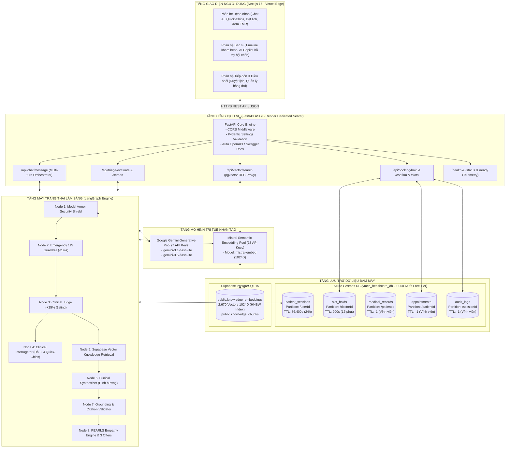

# VMEC - Hệ Thống Trợ Lý Lâm Sàng Đa Lượt & Điều Phối Lịch Khám Y Tế Thông Minh

P-208 là trợ lý AI hỗ trợ định hướng chuyên khoa và đặt lịch khám có kiểm duyệt của con người. Hướng dẫn này phản ánh **mã đang chạy trong repository**:

- Backend Flask nằm tại thư mục [backend](backend), chạy ở cổng 5000.
- Frontend Next.js nằm tại thư mục [frontend](frontend), chạy ở cổng 3000.
- MongoDB và Redis có thể chạy local qua Docker Compose.
- Supabase được dùng cho Auth, PostgreSQL/pgvector, lịch hẹn và QR; đây là phần tích hợp tùy chọn ở lần chạy đầu.

> Lưu ý: các tệp cấu hình ở thư mục gốc như requirements.txt, pyproject.toml, Dockerfile, docker-compose.yml và Makefile vẫn thuộc khung FastAPI cũ trên cổng 8000. Không dùng chúng để chạy hệ thống hiện tại; hãy dùng cấu hình trong backend và frontend.

## Yêu cầu

- Node.js 20.9 trở lên và npm.
- Docker Desktop kèm Docker Compose (cách chạy backend được khuyến nghị).
- CPython 3.11 nếu chạy backend hoặc test trực tiếp trên máy.
- API key của một nhà cung cấp LLM. Backend hỗ trợ openrouter, openai, google và deepseek.
- Một Supabase development project chỉ khi cần đăng nhập thật, đặt lịch, QR hoặc RAG.

Docker Compose trong backend khởi động API, service MCP catalog nội bộ, MongoDB và Redis. MCP mặc định
không được API sử dụng khi feature flag tắt. Compose **không** tạo PostgreSQL hay Supabase local.

## Biến môi trường

Nguồn cấu hình đang chạy là [backend/.env.example](backend/.env.example), [backend/app/config.py](backend/app/config.py) và [frontend/.env.example](frontend/.env.example). Hãy dùng hai tệp dưới đây; không dùng tệp env ở thư mục gốc vì chúng thuộc khung FastAPI cũ.

- Backend: sao chép backend/.env.example thành backend/.env.
- Frontend: sao chép frontend/.env.example thành frontend/.env.local.

Không commit các tệp env. Mọi giá trị có hậu tố SECRET, API_KEY, JWT_SECRET, DATABASE_URL hoặc PASSWORD chỉ được đặt ở Backend. Bất kỳ biến nào bắt đầu bằng NEXT_PUBLIC_ đều được đóng gói vào trình duyệt.

### Backend — backend/.env

Đây là cấu hình tối thiểu để chạy chat local bằng Docker Compose. Thay giá trị placeholder bằng credential của môi trường; không dùng credential production cho local development.

~~~env
FLASK_ENV=development
AUTH_MODE=dev_anonymous
MONGODB_URI=mongodb://mongo:27017
MONGODB_DATABASE=p208
REDIS_URL=redis://redis:6379/0

LLM_PROVIDER=openrouter
LLM_API_KEY=<server-only-llm-key>
LLM_MODEL=openai/gpt-4o-mini
RAG_ENABLED=false

CORS_ALLOWED_ORIGINS=http://localhost:3000
LOG_LEVEL=INFO
~~~

Khi chạy Python trực tiếp trên máy host, đổi MONGODB_URI thành mongodb://localhost:27017 và REDIS_URL thành redis://localhost:6379/0. Có thể bỏ REDIS_URL nếu chấp nhận SSE chỉ có fallback in-process.

#### Runtime, MongoDB, Redis và LLM

| Biến | Mặc định / giá trị hợp lệ | Mục đích |
| --- | --- | --- |
| FLASK_ENV | development | Môi trường ứng dụng. production không cho phép AUTH_MODE=dev_anonymous. |
| AUTH_MODE | dev_anonymous hoặc supabase_jwt | Chế độ xác thực. Dùng dev_anonymous chỉ ở local development. |
| MONGODB_URI | code: mongodb://localhost:27017; mẫu Docker: mongodb://mongo:27017 | Kết nối lưu session, message và execution chat. |
| MONGODB_DATABASE | p208 | Tên database MongoDB. |
| REDIS_URL | rỗng; mẫu Docker: redis://redis:6379/0 | Redis cho publish notification giữa process. Bỏ trống sẽ dùng fallback in-process. |
| LLM_PROVIDER | openai, openrouter, google hoặc deepseek; mặc định openrouter | Provider của model chat. |
| LLM_API_KEY | rỗng | Bắt buộc cùng LLM_MODEL để gọi model và để endpoint ready thành công. Chỉ đặt ở Backend. |
| LLM_MODEL | rỗng trong code; mẫu là openai/gpt-4o-mini | Tên model của provider đã chọn. |
| LLM_TIMEOUT_SECONDS | 30; từ 1 đến 120 | Timeout gọi model. |
| CHAT_HISTORY_LIMIT | 20; từ 1 đến 100 | Số message gần nhất đưa vào ngữ cảnh chat. |
| CORS_ALLOWED_ORIGINS | http://localhost:3000 | Danh sách origin, cách nhau bằng dấu phẩy, được Flask cho phép gọi API. |
| LOG_LEVEL | INFO; DEBUG, INFO, WARNING, ERROR hoặc CRITICAL | Mức log namespace backend. |

#### Supabase, Auth, booking và QR

| Biến | Mặc định / điều kiện | Mục đích |
| --- | --- | --- |
| SUPABASE_DATABASE_URL | rỗng | PostgreSQL URL dùng bởi SQLAlchemy/Alembic và kích hoạt booking stack. Hỗ trợ postgres:// và postgresql://; backend tự chuẩn hóa sang Psycopg. |
| SUPABASE_URL | rỗng | URL project Supabase. Bắt buộc cho Auth, RAG và Supabase Storage. |
| SUPABASE_SECRET_KEY | rỗng | Khóa server Supabase cho Data API, RAG, QR Storage và script admin/seed. Không bao giờ đưa sang Frontend. |
| SUPABASE_SERVICE_ROLE_KEY | alias của SUPABASE_SECRET_KEY | Chỉ dùng khi môi trường đang lưu khóa server với tên legacy này. |
| SUPABASE_ANON_KEY | rỗng | Bắt buộc cho AuthService khi AUTH_MODE=supabase_jwt. Trong tích hợp hiện tại vẫn chỉ cấu hình ở Backend. |
| SUPABASE_JWT_SECRET | rỗng, tùy chọn | Fallback xác minh JWT HS256 legacy; token ES256/RS256 dùng JWKS từ SUPABASE_URL. |
| RECEPTIONIST_APPROVAL_TIMEOUT_MINUTES | 30; từ 5 đến 1440 | Hạn chờ lễ tân duyệt appointment. |
| PATIENT_CONFIRMATION_TIMEOUT_MINUTES | 15; từ 5 đến 1440 | Hạn bệnh nhân xác nhận lịch thay thế. |
| DEFAULT_RECEPTIONIST_ID | rỗng | UUID lễ tân nhận notification mặc định khi chưa có phân công tự động. |
| APPOINTMENT_QR_BUCKET | appointment-qr | Bucket private lưu ảnh QR sau khi appointment được xác nhận. |
| APPOINTMENT_QR_VERIFY_BASE_URL | http://localhost:3000/verify-appointment | Base URL nhúng vào QR. Đặt domain HTTPS thật khi production. |
| APPOINTMENT_QR_SIGNED_URL_TTL_SECONDS | 300; từ 60 đến 3600 | Thời gian sống của signed URL QR. |

Để bật đăng nhập thật, cần đồng thời AUTH_MODE=supabase_jwt, SUPABASE_DATABASE_URL, SUPABASE_URL và SUPABASE_ANON_KEY. QR còn cần SUPABASE_SECRET_KEY. Với Supabase Transaction Pooler cổng 6543, backend tự tắt prepared statements và dùng NullPool.

#### RAG và embedding

| Biến | Mặc định / giá trị hợp lệ | Mục đích |
| --- | --- | --- |
| RAG_ENABLED | code: false; mẫu env: true | Bật retrieval y tế. Khi chưa có Supabase/embedding, đặt false. |
| EMBEDDING_PROVIDER | openrouter hoặc openai; mặc định openrouter | Provider sinh vector. |
| EMBEDDING_API_KEY | rỗng | Khóa embedding ưu tiên. Bắt buộc khi fallback không cung cấp được khóa hợp lệ. |
| OPENROUTER_API_KEY | rỗng, fallback | Được dùng khi EMBEDDING_PROVIDER=openrouter và EMBEDDING_API_KEY rỗng. |
| OPENAI_API_KEY | rỗng, fallback | Được dùng khi EMBEDDING_PROVIDER=openai và EMBEDDING_API_KEY rỗng. |
| EMBEDDING_MODEL | openai/text-embedding-3-small với OpenRouter; text-embedding-3-small với OpenAI | Model embedding. |
| EMBEDDING_DIMENSION | 1024, bắt buộc | Phải khớp schema pgvector hiện có. |
| EMBEDDING_BATCH_SIZE | 64; từ 1 đến 2048 | Số input embedding mỗi batch. |
| RAG_TOP_K | 4; từ 1 đến 10 | Số chunk retrieval tối đa. |
| RAG_SIMILARITY_THRESHOLD | 0.40; từ 0 đến 1 | Ngưỡng similarity tối thiểu. |
| RAG_MAX_CONTEXT_TOKENS | 2000; từ 256 đến 8000 | Ngân sách context RAG đưa vào model. |

RAG cần RAG_ENABLED=true, SUPABASE_URL, một khóa server Supabase, embedding API key hợp lệ và EMBEDDING_MODEL. Nếu EMBEDDING_API_KEY và fallback provider đều trống, backend chỉ tái sử dụng LLM_API_KEY khi LLM_PROVIDER trùng EMBEDDING_PROVIDER.

#### Langfuse tracing tùy chọn

| Biến | Mặc định / điều kiện | Mục đích |
| --- | --- | --- |
| LANGFUSE_TRACING_ENABLED | false | Bật tracing metadata-only khi đủ các khóa bên dưới. |
| LANGFUSE_PUBLIC_KEY | rỗng | Public key Langfuse của Backend. |
| LANGFUSE_SECRET_KEY | rỗng | Secret key Langfuse, chỉ Backend. |
| LANGFUSE_PSEUDONYMIZATION_KEY | rỗng; tối thiểu 32 byte UTF-8 | Khóa HMAC riêng để pseudonym hóa user/session. Không dùng lại API key. |
| LANGFUSE_BASE_URL | https://cloud.langfuse.com | URL HTTP(S) không chứa credential; production bắt buộc HTTPS. |
| LANGFUSE_TRACING_ENVIRONMENT | mặc định FLASK_ENV | Tên environment chữ thường, gồm chữ số, gạch nối hoặc gạch dưới. |
| LANGFUSE_RELEASE | rỗng | Nhãn release tùy chọn. |
| LANGFUSE_SAMPLE_RATE | 1.0; từ 0 đến 1 | Tỷ lệ lấy mẫu trace. |
| LANGFUSE_TIMEOUT_SECONDS | 5; từ 1 đến 60 | Timeout export tracing. |

Thiếu bất kỳ khóa Langfuse bắt buộc nào sẽ khiến backend dùng no-op tracing; không làm endpoint ready lỗi. Không đưa bất kỳ biến Langfuse nào sang Frontend.

#### MCP tra cứu bác sĩ và lịch rảnh (tùy chọn)

MCP catalog mặc định tắt. Khi bật, Flask chỉ gọi URL tĩnh trong mạng private và không mở endpoint MCP cho
frontend. Service `mcp-catalog` trong Compose chỉ `expose` cổng 8001, không publish ra host/Internet.

| Biến | Process | Mục đích |
| --- | --- | --- |
| MCP_CATALOG_ENABLED | API | Bật ưu tiên MCP trong CatalogGraph; production chỉ bật sau migration và smoke test. |
| MCP_SERVER_URL | API | URL tĩnh, ví dụ `http://mcp-catalog:8001/mcp`; không cho credential/query. |
| MCP_INTERNAL_TOKEN | Cả hai | Bearer secret nội bộ tối thiểu 32 byte; cấp qua secret store. |
| MCP_TIMEOUT_SECONDS | API | Timeout toàn tool call, mặc định 5 giây. |
| MCP_DATABASE_URL | MCP | DSN login chỉ-đọc kế thừa `p208_mcp_reader`; không dùng DSN API có quyền ghi. |
| MCP_LLM_PROVIDER, MCP_LLM_API_KEY, MCP_LLM_MODEL | MCP | Model riêng cho structured Text-to-SQL catalog. |
| MCP_LLM_TIMEOUT_SECONDS | MCP | Timeout model, mặc định 30 giây. |
| MCP_QUERY_TIMEOUT_MS, MCP_MAX_ROWS | MCP | Mặc định 2000 ms và tối đa 50 dòng/fetch. |

Migration `20260815_0007` tạo hai view private và role group nhưng không tạo login/mật khẩu. Sau khi chạy
Alembic, DBA phải provision login runtime bên ngoài repository, grant membership role và đặt DSN vào secret
store. Kiểm tra `http://mcp-catalog:8001/health` và `/ready` từ mạng nội bộ trước khi bật feature flag.

#### Chỉ dùng cho script hoặc test

| Biến | Khi nào dùng |
| --- | --- |
| DOCTOR_SEED_PASSWORD | Script seed bác sĩ và seed_da_lieu với --apply. |
| RECEPTIONIST_SEED_PASSWORD | Script seed lễ tân. |
| ACCOUNT_SEED_EMAIL_DOMAIN | Domain tài khoản của script seed hàng loạt; mặc định p208.local. |
| VERIFY_RECEPTIONIST_ID | ID lễ tân cho helper verify_reception_api; có default demo trong script. |
| VERIFY_API_BASE | Base API của helper verify_reception_api; mặc định http://localhost:5000. |
| BOOKING_TEST_DATABASE_URL | Bật test integration booking PostgreSQL. Dùng database disposable vì test thay đổi schema/data. |
| MCP_ROLE_TEST_DATABASE_URL | DSN dedicated reader để chứng minh chỉ đọc được hai view MCP, không đọc bảng gốc/ghi dữ liệu. |
| RUN_MONGODB_INTEGRATION | Đặt 1 để bật test MongoDB integration thật. |

Các tên DATABASE_URL, SUPABASE_JWKS_URL, SUPABASE_JWT_ISSUER và SUPABASE_PUBLISHABLE_KEY xuất hiện trong tài liệu kiến trúc cũ nhưng không được Backend hiện tại đọc. Dùng SUPABASE_DATABASE_URL và SUPABASE_ANON_KEY như bảng trên.

### Frontend — frontend/.env.local

Frontend hiện không kết nối trực tiếp Supabase hoặc database; nó chỉ gọi Flask API. Tạo frontend/.env.local từ [frontend/.env.example](frontend/.env.example):

~~~env
NEXT_PUBLIC_API_URL=http://localhost:5000

# Chỉ local development khi Backend dùng AUTH_MODE=dev_anonymous.
NEXT_PUBLIC_DEV_USER_ID=11111111-1111-4111-8111-111111111111
NEXT_PUBLIC_DEV_USER_ROLE=PATIENT
~~~

| Biến | Mặc định / giá trị hợp lệ | Mục đích |
| --- | --- | --- |
| NEXT_PUBLIC_API_URL | fallback http://localhost:5000 | Base URL Flask cho API và SSE notification. Không thêm /api/v1 ở cuối; dấu / cuối sẽ tự được bỏ. |
| NEXT_PUBLIC_DEV_USER_ID | rỗng | UUID local gửi qua X-Dev-User-Id khi không có phiên đăng nhập thật. Chỉ dùng cùng AUTH_MODE=dev_anonymous. |
| NEXT_PUBLIC_DEV_USER_ROLE | PATIENT ở header request; RoleGuard cần đặt tường minh | Role local. RoleGuard chỉ chấp nhận PATIENT, RECEPTIONIST hoặc DOCTOR trong development. |

Khi đặt NEXT_PUBLIC_DEV_USER_ID, cũng phải đặt NEXT_PUBLIC_DEV_USER_ROLE hợp lệ: API request có thể mặc định PATIENT, nhưng RoleGuard sẽ không cấp quyền dev nếu role không được đặt tường minh. Xóa cả hai biến ở production. NODE_ENV do Next.js quản lý, không cần tự thêm vào env file.

## Chạy nhanh local bằng Docker

Quy trình này đủ để chạy UI, chat và các guardrail ở chế độ phát triển. Nó dùng định danh phát triển, không cần Supabase.

### 1. Cấu hình backend

Từ thư mục gốc, tạo backend/.env từ mẫu nếu tệp này chưa tồn tại:

~~~powershell
Copy-Item backend\.env.example backend\.env
~~~

Mở backend/.env và tối thiểu đặt cấu hình sau. Không ghi API key thật vào Git.

~~~env
AUTH_MODE=dev_anonymous
LLM_PROVIDER=openrouter
LLM_API_KEY=<api-key-cua-ban>
LLM_MODEL=openai/gpt-4o-mini
RAG_ENABLED=false
~~~

Đặt RAG_ENABLED=false khi chưa cấu hình Supabase và embedding. Các giá trị MongoDB/Redis mặc định trong mẫu dùng hostname nội bộ của Docker Compose, nên giữ nguyên khi chạy theo cách này.

Khởi động API, MCP catalog nội bộ, MongoDB và Redis:

~~~powershell
docker compose -f backend/docker-compose.yml up --build
~~~

Mở một terminal khác để kiểm tra:

~~~powershell
Invoke-RestMethod http://localhost:5000/health
Invoke-RestMethod http://localhost:5000/ready
~~~

Endpoint health phải phản hồi thành công. Endpoint ready chỉ thành công khi MongoDB truy cập được, LLM được cấu hình và RAG ở trạng thái hợp lệ.

### 2. Cấu hình và chạy frontend

Tạo frontend/.env.local từ mẫu nếu tệp này chưa tồn tại:

~~~powershell
Copy-Item frontend\.env.example frontend\.env.local
Set-Location frontend
~~~

Trong frontend/.env.local, dùng cấu hình phát triển sau:

~~~env
NEXT_PUBLIC_API_URL=http://localhost:5000
NEXT_PUBLIC_DEV_USER_ID=11111111-1111-4111-8111-111111111111
NEXT_PUBLIC_DEV_USER_ROLE=PATIENT
~~~

NEXT_PUBLIC_DEV_USER_ID phải là UUID hợp lệ. Các biến này chỉ dành cho AUTH_MODE=dev_anonymous và không phải cơ chế đăng nhập hoặc phân quyền thực; không đưa chúng lên môi trường production.

Cài dependency theo lockfile và chạy Next.js:

~~~powershell
npm ci
npm run dev
~~~

Mở [http://localhost:3000](http://localhost:3000). Frontend sẽ gọi backend tại [http://localhost:5000](http://localhost:5000).

## Chạy backend trực tiếp bằng Python

Dùng cách này khi cần debug backend ngoài container. Vẫn cần MongoDB và Redis; có thể chỉ bật hai service phụ thuộc bằng Docker:

~~~powershell
docker compose -f backend/docker-compose.yml up -d mongo redis
py -3.11 -m venv .venv
.\.venv\Scripts\python.exe -m pip install --upgrade pip
.\.venv\Scripts\python.exe -m pip install -r backend\requirements.txt
~~~

Khi chạy Python trên máy host, sửa hai giá trị trong backend/.env vì hostname mongo và redis chỉ tồn tại trong mạng Docker:

~~~env
MONGODB_URI=mongodb://localhost:27017
REDIS_URL=redis://localhost:6379/0
~~~

Sau đó chạy backend từ thư mục gốc:

~~~powershell
.\.venv\Scripts\python.exe -m backend.run
~~~

## Bật các tính năng Supabase

Chỉ thực hiện phần này với một Supabase project development/staging riêng. Không đặt SUPABASE_SECRET_KEY, SUPABASE_SERVICE_ROLE_KEY, SUPABASE_JWT_SECRET, khóa LLM hoặc khóa embedding ở frontend.

### Auth và đặt lịch thật

Thêm các biến sau vào backend/.env:

~~~env
AUTH_MODE=supabase_jwt
SUPABASE_DATABASE_URL=postgresql+psycopg://postgres.<project-ref>:<password>@<host>:5432/postgres?sslmode=require
SUPABASE_URL=https://<project-ref>.supabase.co
SUPABASE_ANON_KEY=<supabase-anon-key>
SUPABASE_SECRET_KEY=<backend-only-secret-key>
CORS_ALLOWED_ORIGINS=http://localhost:3000
~~~

SUPABASE_DATABASE_URL kích hoạt profile repository và booking stack. Nếu dùng Supabase Transaction Pooler ở cổng 6543, backend tự dùng NullPool và tắt prepared statements cho Psycopg.

### Migration database

Migration thay đổi schema. Sao lưu dữ liệu và chỉ chạy trên database dành riêng cho development/staging. Với một Supabase database mới, trước hết hãy xem xét và chạy script tiền đề tạo profiles/Auth trong Supabase SQL Editor:

~~~text
backend/migrations/sql/20260805_0004_create_profiles_and_auth.sql
~~~

Sau đó, khi SUPABASE_DATABASE_URL đã được cấu hình, chạy chuỗi Alembic:

~~~powershell
.\.venv\Scripts\python.exe -m alembic -c backend\alembic.ini upgrade head
~~~

Chuỗi Alembic hiện tại có revision xoá các slot AVAILABLE cũ, vì vậy không chạy mù trên database dùng chung. Các SQL script còn lại trong backend/migrations/sql là lịch sử hoặc tương thích; không chạy chồng chúng lên database đã được quản lý bằng Alembic nếu chưa có kế hoạch migration rõ ràng.

### RAG với pgvector

Sau khi Supabase đã được khởi tạo với migration phù hợp, bật RAG trong backend/.env:

~~~env
RAG_ENABLED=true
EMBEDDING_PROVIDER=openrouter
EMBEDDING_API_KEY=<embedding-api-key>
EMBEDDING_MODEL=openai/text-embedding-3-small
EMBEDDING_DIMENSION=1024
~~~

Embedding cần khóa hợp lệ cho đúng provider. Nếu chat và embedding cùng dùng OpenRouter, có thể để EMBEDDING_API_KEY trống để dùng lại LLM_API_KEY.

Lệnh sau gọi API embedding và ghi dữ liệu vào Supabase; chỉ chạy khi bạn đã xem xét tài liệu nguồn và chi phí API:

~~~powershell
.\.venv\Scripts\python.exe -m backend.scripts.ingest_knowledge data\processed\diseases\du_lieu_benh_trieu_chung_heading.md
~~~

## Sample queries

Sau khi mở giao diện tại [http://localhost:3000](http://localhost:3000), có thể nhập trực tiếp các câu dưới đây vào cửa sổ chat để thử từng luồng.

### Chat và định hướng chuyên khoa

- `Tôi bị nghẹt mũi, đau họng và ho nhẹ được ba ngày, tôi nên khám chuyên khoa nào?`
- `Mắt tôi thường xuyên ngứa, đỏ và chảy nước mắt khi ra ngoài, tôi nên làm gì tiếp theo?`
- `Tôi đau vùng thượng vị sau khi ăn và hay đầy bụng, tôi nên khám khoa nào?`
- `Tôi bị đau đầu gối khi chạy bộ, không bị ngã hay chấn thương, nên khám chuyên khoa nào?`

### RAG trên tài liệu y tế

Các câu này cần `RAG_ENABLED=true`, cấu hình embedding/Supabase hợp lệ và đã ingest tài liệu kiến thức.

- `Viêm mũi dị ứng thường có những triệu chứng nào?`
- `Trào ngược dạ dày thực quản có các dấu hiệu thường gặp nào?`
- `Những nguyên nhân phổ biến nào có thể gây đau khớp gối khi vận động?`
- `Hãy giải thích viêm kết mạc và cho tôi biết khi nào nên đi khám.`

### Tra cứu bác sĩ và lịch trống

Các câu này cần booking stack, catalog bác sĩ và dữ liệu lịch trong PostgreSQL/Supabase.

- `Danh sách bác sĩ khoa Tai Mũi Họng gồm những ai?`
- `Bác sĩ nào đang nhận lịch ở khoa Hô hấp?`
- `Bác sĩ đó còn lịch trống trong 7 ngày tới không?`
- `Cho tôi xem các khung giờ trống của bác sĩ vừa đề xuất.`

Hai câu cuối nên được gửi sau câu hỏi về bác sĩ trong cùng một phiên chat để kiểm tra khả năng dùng ngữ cảnh hội thoại.

### Guardrail khẩn cấp

Chỉ dùng mẫu sau trong môi trường local/test. Khi hệ thống được cấu hình đầy đủ, nội dung cấp cứu có thể tạo handover và gửi thông báo thật tới tài khoản lễ tân đang hoạt động.

- `Tôi đang đau ngực dữ dội và khó thở.`
- `Người nhà tôi đột ngột méo miệng, yếu một bên người và nói khó.`

AI chỉ hỗ trợ định hướng và không thay thế chẩn đoán hoặc xử trí của nhân viên y tế.

## Kiểm thử và kiểm tra chất lượng

Backend:

~~~powershell
.\.venv\Scripts\python.exe -m pytest backend\tests -q
.\.venv\Scripts\python.exe -m ruff check backend
.\.venv\Scripts\python.exe -m ruff format --check backend
~~~

Chạy integration test MongoDB trong container:

~~~powershell
docker compose -f backend/docker-compose.yml --profile test run --rm test
~~~

Frontend, từ thư mục frontend:

~~~powershell
npm run lint
npx tsc --noEmit
npm run build
~~~

Các test booking dùng PostgreSQL cần một database disposable riêng; không trỏ chúng vào database có dữ liệu thật.

## Khắc phục sự cố thường gặp

| Hiện tượng | Cách xử lý |
| --- | --- |
| /health thành công nhưng /ready trả 503 | Kiểm tra MongoDB, LLM_API_KEY/LLM_MODEL và đặt RAG_ENABLED=false nếu chưa có Supabase/embedding. |
| Backend chạy Python không kết nối được mongo hoặc redis | Đổi URI trong backend/.env sang localhost như phần chạy trực tiếp bằng Python. |
| UI gọi nhầm cổng 8000 | Đặt NEXT_PUBLIC_API_URL=http://localhost:5000; cổng 8000 thuộc cấu hình FastAPI cũ ở thư mục gốc. |
| Login hoặc booking trả SERVICE_UNAVAILABLE | Hoàn tất AUTH_MODE=supabase_jwt và toàn bộ cấu hình Supabase, gồm SUPABASE_DATABASE_URL. |
| Frontend không có danh tính ở chế độ dev | Đặt NEXT_PUBLIC_DEV_USER_ID thành UUID hợp lệ rồi khởi động lại Next.js. |

# VMEC - Hệ Thống Trợ Lý Lâm Sàng Đa Lượt & Điều Phối Lịch Khám Y Tế Thông Minh

VMEC (Vinmec Medical Expert Copilot) là giải pháp y tế số thông minh chuẩn doanh nghiệp phục vụ phân loại lâm sàng ban đầu (Triage), thu thập triệu chứng có kiểm soát qua mô hình hội thoại đa lượt có trạng thái (Stateful Multi-Turn Clinical Agent), và điều phối đặt lịch khám chuyên khoa tự động.

Hệ thống được phát triển trên kiến trúc Microservices / Monorepo hiện đại, kết hợp mô hình điều phối luồng LangGraph, cơ sở dữ liệu phân tán Azure Cosmos DB, hệ thống tìm kiếm vector ngữ nghĩa Supabase pgvector 1024 chiều, cùng tầng bảo mật dữ liệu y tế Google Model Armor.

---

## 1. Mục Tiêu & Nguyên Lý Thiết Kế Hệ Thống

### 1.1. Mục tiêu cốt lõi
- Thu thập bệnh sử có cấu trúc: Tự động hóa quá trình hỏi bệnh theo 4 nhóm trường lâm sàng chuẩn mực, giúp tiết kiệm 70% thời gian tiếp nhận ban đầu của nhân viên y tế.
- Chống ảo giác và chặn chẩn đoán sai: Tuyệt đối không tự ý đưa ra kết luận bệnh học xác định hoặc kê đơn điều trị; mọi gợi ý chuyên khoa phải đi kèm trích dẫn văn bản quy chuẩn chính thống của Bộ Y Tế.
- An toàn tuyệt đối trước cấp cứu: Phát hiện tức thì các dấu hiệu đe dọa tính mạng (đột quỵ, nhồi máu cơ tim, sốc phản vệ) dưới 1 mili-giây trước khi đi vào xử lý mô hình ngôn ngữ lớn (LLM).
- Tính nhất quán và chống xung đột lịch khám: Cơ chế khóa giữ chỗ 15 phút trên tầng lưu trữ NoSQL ngăn chặn triệt để tình trạng trùng lặp lịch hẹn giữa nhiều bệnh nhân trong cùng một khung giờ.

### 1.2. Các trụ cột kiến trúc
- Stateful Session Lifecycle: Quản lý trạng thái hội thoại độc lập theo phiên người dùng, tự động phục hồi ngữ cảnh từ cơ sở dữ liệu sau mỗi lượt trao đổi.
- Deterministic Guardrails First: Ưu tiên bộ lọc quy tắc tất định trước khi gọi mô hình xác suất LLM.
- Zero Secret Exposure: Áp dụng cơ chế phân tách nghiêm ngặt giữa mã nguồn công khai và khóa bảo mật môi trường.
- High Availability & Multi-Key Load Balancing: Cơ chế xoay vòng vòng tròn (Round-Robin) trên các nhóm API Key giúp duy trì hoạt động 24/7 không gián đoạn bởi giới hạn băng thông.

---

## 2. Sơ Đồ Kiến Trúc Hệ Thống



---

## 3. Danh Mục Công Nghệ Sử Dụng

| Tầng hệ thống | Công nghệ / Nền tảng | Phiên bản | Vai trò & Mục đích |
| :--- | :--- | :--- | :--- |
| Frontend Framework | Next.js (App Router, Turbopack) | 16.3.0 | Giao diện người dùng Web, Server-Side Rendering, API Proxy |
| UI Library | React & TypeScript | 19.0.0 / 5.x | Quản lý Component, kiểu dữ liệu tĩnh nghiêm ngặt |
| Styling | Tailwind CSS & Lucide Icons | 3.4.x | Thiết kế giao diện y tế đáp ứng (Responsive), tối ưu trải nghiệm |
| Frontend Hosting | Vercel Edge Network | Production | Phân phối giao diện tĩnh và máy chủ biên toàn cầu |
| Backend Server | FastAPI & Uvicorn | Python 3.12 | Máy chủ API bất đồng bộ (Asynchronous ASGI), tài liệu OpenAPI tự động |
| Data Validation | Pydantic v2 & Pydantic Settings | 2.13.x | Kiểm định dữ liệu đầu vào/ra, quản lý biến môi trường |
| Orchestration | LangGraph & LangChain Core | 1.2.11 / 0.3.x | Xây dựng máy trạng thái chu trình hội thoại lâm sàng có kiểm soát |
| Generative AI | Google Gemini API (Pool 7 Keys) | 3.1 & 3.5 Flash Lite | Xoay vòng mô hình thẩm định slot, đặt câu hỏi và tổng hợp định hướng |
| Embedding AI | Mistral AI API (Pool 13 Keys) | mistral-embed | Sinh vector nhúng ngữ nghĩa 1024 chiều từ văn bản triệu chứng |
| NoSQL Database | Azure Cosmos DB (NoSQL API) | 4.16.x SDK | Lưu trữ phiên hội thoại (TTL 24h), khóa giữ chỗ (TTL 15m), EMR |
| Vector Database | Supabase PostgreSQL (pgvector) | 15.x / HNSW | Lưu trữ và truy vấn tương đồng 2.670 vector tri thức chuyên khoa Bộ Y Tế |
| Containerization | Docker & Docker Compose | Multi-stage | Đóng gói môi trường thực thi chuẩn hóa, hỗ trợ triển khai nhanh |
| Backend Hosting | Render Web Service (Singapore) | Python 3.12 | Máy chủ ứng dụng thường trực 24/7 |
| Testing & Quality | Pytest, Pytest-Asyncio, Ruff | 9.1.x / 0.16.x | Bộ kiểm thử tự động 35 kịch bản và phân tích cú pháp tĩnh |

---

## 4. Đặc Tả Luồng Hội Thoại Lâm Sàng Đa Lượt (LangGraph Clinical Workflow)

Hệ thống triển khai giao thức phân loại 4 chặng có kiểm soát. Mỗi lượt trao đổi thành công nâng tiến độ thêm 25%, hướng dẫn người bệnh cung cấp đầy đủ thông tin trước khi đưa ra khuyến nghị chuyên khoa:

```
Lượt 1 (25% Tiến độ) : Thu thập Vị trí & Triệu chứng chính (chiefComplaint)
                        --> Trích xuất sự thật lâm sàng 1 (atomic_fact_1)
                        --> Sinh 04 Quick-Chips định hướng tính chất cơn đau

Lượt 2 (50% Tiến độ) : Thu thập Tính chất, Cường độ & Hướng lan (characterTriggers)
                        --> Trích xuất sự thật lâm sàng 2 (atomic_fact_2)
                        --> Sinh 04 Quick-Chips định hướng thời gian

Lượt 3 (75% Tiến độ) : Thu thập Thời gian, Tần suất & Diễn tiến (duration)
                        --> Trích xuất sự thật lâm sàng 3 (atomic_fact_3)
                        --> Sinh 04 Quick-Chips định hướng dấu hiệu kèm theo

Lượt 4 (100% Tiến độ): Thu thập Dấu hiệu cảnh báo kèm theo (associatedSigns)
                        --> Kích hoạt truy vấn Supabase pgvector RAG (1024D)
                        --> Tổng hợp Khuyến nghị Chuyên khoa + Trích dẫn tài liệu Bộ Y Tế
                        --> Áp dụng Khung thấu cảm PEARLS xoa dịu tâm lý
                        --> Đề xuất 03 Khung giờ khám với Bác sĩ chuyên khoa tương ứng
```

### 4.1. Quy chuẩn an toàn và loại trừ cấp cứu (Emergency 115)
- Bộ sàng lọc tất định (Deterministic Screener) quét các mẫu từ khóa nguy cấp: ngưng tim, đột quỵ (FAST: méo miệng, yếu liệt tay chân, khó nói), nhồi máu cơ tim (đau ngực dữ dội kèm vã mồ hôi lạnh), sốc phản vệ, khó thở cấp tính.
- Xử lý chính xác câu phủ định ngôn ngữ tự nhiên: *"Bệnh nhân không sốt"*, *"Tôi không thấy tức ngực"* được loại trừ an toàn, không kích hoạt báo động giả.

### 4.2. Bộ lọc bảo vệ Model Armor & Quyền riêng tư (DLP / PHI Masking)
- Phát hiện và vô hiệu hóa 100% các câu lệnh cố ý phá vỡ ngữ cảnh (Prompt Injection, Jailbreak, System Prompt Leak).
- Tự động nhận diện và làm mờ các dữ liệu định danh cá nhân nhạy cảm: Số Căn cước công dân (CCCD), Số điện thoại cá nhân, Mã thẻ bảo hiểm y tế trước khi lưu trữ hoặc chuyển tiếp qua mô hình AI.

---

## 5. Cấu Trúc Cơ Sở Dữ Liệu & Phân Vùng Lưu Trữ

### 5.1. Azure Cosmos DB Collections (`vmec_healthcare_db`)

| Container Name | Partition Key | Cấu hình TTL | Mô tả dữ liệu lưu trữ |
| :--- | :--- | :--- | :--- |
| `patient_sessions` | `/userId` | `86.400s` (24 giờ) | Trạng thái phiên hội thoại đa lượt, tiến độ %, 4 slots dữ liệu lâm sàng, danh sách atomic facts. Tự động thu hồi sau 24h. |
| `slot_holds` | `/doctorId` | `900s` (15 phút) | Khóa tạm thời khung giờ khám của bác sĩ trong 15 phút khi bệnh nhân mở màn hình thanh toán. Tự động giải phóng nếu quá hạn. |
| `medical_records` | `/patientId` | `-1` (Vĩnh viễn) | Tóm tắt bệnh án điện tử (EMR) sinh ra sau khi hoàn tất phân loại lâm sàng, phục vụ bác sĩ xem trước khi khám. |
| `appointments` | `/patientId` | `-1` (Vĩnh viễn) | Thông tin lịch khám chính thức đã được người bệnh xác nhận hoặc nhân viên lễ tân phê duyệt. |
| `audit_logs` | `/sessionId` | `-1` (Vĩnh viễn) | Nhật ký kiểm toán bảo mật: ghi nhận sự kiện chặn mã độc Model Armor, kích hoạt cấp cứu 115, xác nhận lịch khám. |

### 5.2. Supabase PostgreSQL pgvector Schema
- Bảng `public.knowledge_embeddings`: Lưu trữ 2.670 vector tri thức y khoa 1024 chiều.
- Chỉ mục: `HNSW (Hierarchical Navigable Small World)` với khoảng cách Cosine Similarity, cho thời gian tìm kiếm trung bình dưới 15ms.
- Hàm gọi từ xa: `match_knowledge_chunks(query_embedding, match_threshold, match_count)`.

---

## 6. Danh Sách Điểm Cuối Triển Khai Đám Mây (Cloud Deployment Endpoints)

| Dịch vụ | Nền tảng | Địa chỉ URL công khai |
| :--- | :--- | :--- |
| Backend API Base | Render (Singapore) | `https://vmec-api.onrender.com` |
| Tài liệu API tương tác (Swagger UI) | Render (Singapore) | `https://vmec-api.onrender.com/docs` |
| Kiểm tra trạng thái máy chủ (Health) | Render (Singapore) | `https://vmec-api.onrender.com/health` |
| Giám sát hệ thống & Database (Status) | Render (Singapore) | `https://vmec-api.onrender.com/status` |
| Giao diện người dùng (Frontend Web) | Vercel Edge | `https://vmec-healthcare-web.vercel.app` |

---

## 7. Hướng Dẫn Cài Đặt & Chạy Cục Bộ (Local Setup Guide)

### 7.1. Yêu cầu môi trường
- Node.js phiên bản 20.9 trở lên và npm.
- Python phiên bản 3.12 trở lên.
- Docker và Docker Compose (tùy chọn).

### 7.2. Cấu hình biến môi trường
Sao chép các tệp mẫu và điền thông tin cấu hình tương ứng:
- Frontend: Sao chép `frontend/.env.example` thành `frontend/.env.local`.
- Backend: Sao chép `backend/.env.example` thành `backend/.env`.

### 7.3. Khởi chạy toàn bộ hệ thống bằng Docker Compose
```bash
docker compose up --build
```
- Giao diện Web: `http://localhost:3000`
- Tài liệu API: `http://localhost:8000/docs`

### 7.4. Khởi chạy từng phân hệ thủ công

#### Khởi chạy Phân hệ Giao diện (Frontend Next.js):
```bash
cd frontend
npm install
npm run dev
```

#### Khởi chạy Phân hệ Xử lý (Backend FastAPI):
```bash
cd backend
python -m venv .venv

# Trên Windows:
.\.venv\Scripts\activate
# Trên macOS / Linux:
source .venv/bin/activate

pip install -r requirements.txt
uvicorn src.main:app --reload --port 8000
```

---

## 8. Kiểm Thử Tự Động & Đảm Bảo Chất Lượng (Quality Assurance)

Dự án duy trì bộ kiểm thử tự động gồm 35 kịch bản bao phủ toàn bộ các tầng chức năng:

```bash
cd backend
pytest -v
```

### Ma trận kịch bản kiểm thử:
- `test_agent_multiturn.py`: Kiểm thử luồng hội thoại 4 lượt, kiểm thử chặn cấp cứu 115, kiểm thử chặn injection.
- `test_api_routes.py`: Kiểm thử toàn bộ 5 router API (`/chat`, `/triage`, `/vector`, `/booking`, `/health`), kiểm thử xác thực mã giữ chỗ không hợp lệ.
- `test_model_armor.py`: Kiểm thử phát hiện prompt injection, kiểm thử chặn rò rỉ thông tin mật, kiểm thử làm mờ PII/PHI.
- `test_emergency.py`: Kiểm thử phát hiện cấp cứu cấp tính, kiểm thử nhận diện câu phủ định, kiểm thử bệnh sử quá khứ.
- `test_grounding.py`: Kiểm thử đề xuất chuyên khoa hợp lệ, kiểm thử thiếu trích dẫn, kiểm thử từ khóa chẩn đoán cấm, kiểm thử URL không thuộc whitelist.
- `test_psychology.py`: Kiểm thử xoa dịu tâm lý khoa Tim mạch, khoa Nhi, và kịch bản fallback.
- `test_llm.py`: Kiểm thử sinh văn bản, kiểm thử sinh cấu trúc JSON, kiểm thử an toàn luồng xoay vòng khóa API.
- `test_embedding.py`: Kiểm thử sinh vector đơn lẻ, kiểm thử sinh vector theo lô, kiểm thử an toàn luồng xoay vòng khóa Mistral.
- `test_vector_search.py`: Kiểm thử khớp vector Supabase, kiểm thử xử lý dữ liệu rỗng và chấm điểm độ tương đồng.
- `test_health.py`: Kiểm thử phản hồi trạng thái máy chủ và đo độ trễ cơ sở dữ liệu.

---

## 9. Quy Trình Phối Hợp Làm Việc Nhóm (Team Git Workflow)

Để đảm bảo an toàn tuyệt đối cho nhánh chính `main` đang vận hành trên máy chủ đám mây, các thành viên tuân thủ quy trình 4 bước:

1. **Cập nhật mã nguồn mới nhất**:
   ```bash
   git checkout main
   git pull origin main
   ```
2. **Tạo nhánh tính năng riêng biệt**:
   ```bash
   git checkout -b feature/ten-tinh-nang
   ```
3. **Commit và đẩy nhánh lên GitHub**:
   ```bash
   git add .
   git commit -m "feat: mô tả ngắn gọn công việc"
   git push origin feature/ten-tinh-nang
   ```
4. **Tạo Pull Request trên GitHub**:
   - Truy cập giao diện GitHub, tạo Pull Request vào nhánh `main`.
   - Sau khi kiểm tra toàn bộ test báo xanh, tiến hành Merge vào `main` để Render và Vercel tự động triển khai.

---

## 10. Tuyên Bố Miễn Trừ Trách Nhiệm Y Tế

Hệ thống VMEC được thiết kế với mục đích hỗ trợ định hướng chuyên khoa và gợi ý lịch khám bệnh lâm sàng ban đầu dựa trên các quy chuẩn tiếp nhận y tế hiện hành.

Mọi thông tin do hệ thống cung cấp không cấu thành chẩn đoán y khoa chính thức, không thay thế quá trình thăm khám trực tiếp của Bác sĩ có chứng chỉ hành nghề, và không đưa ra chỉ định dùng thuốc. Trong trường hợp có dấu hiệu nguy kịch đe dọa tính mạng, người bệnh phải lập tức liên hệ Tổng đài Cấp cứu 115 hoặc đến Cơ sở Y tế gần nhất.

