# HỒ SƠ ĐẶC TẢ TOÀN DIỆN VÀ CHUYÊN SÂU TẬP DATASET VMEC-01
**(Vietnam Medical & Healthcare AI Clinical Routing, Booking & Governance Master Dossier)**

---

## 1. TỔNG QUAN HỆ THỐNG & ĐẶC TẢ DỰ ÁN

| Thuộc tính định danh | Giá trị chi tiết | Ghi chú & Tiêu chuẩn |
| :--- | :--- | :--- |
| **Mã dự án (Project ID)** | `VMEC-01` | Dự án Bộ dữ liệu Chuẩn hóa AI Y tế Việt Nam |
| **Phiên bản Context** | `6.1.0-live-url-precise-citations` | Tiêu chuẩn trích dẫn nguồn locator HTML/PDF chính xác |
| **Quy mô phân rã** | **40 Batches độc lập** (`B01` $\rightarrow$ `B40`) | Phân rã theo từng chuyên khoa và nghiệp vụ |
| **Tổng số bản ghi dữ liệu lõi** | **11,700 bản ghi** (`DATA` rows) | Đã làm sạch và chuẩn hóa 100% |
| **Nguồn trích dẫn pháp lý xác thực** | **323 nguồn văn bản** | Bộ Y tế, BV Bạch Mai, BV Từ Dũ, Cục QLKCB, WHO, CDC |
| **Tiêu chuẩn Y tế & AI** | **HL7 FHIR R4 v4.0.1 & NIST AI RMF** | Resource: `Practitioner`, `Schedule`, `Slot`, `Questionnaire` |
| **Nguyên tắc an toàn dữ liệu** | **Zero PII / PHI Omitted & Fail-closed** | Tuyệt đối không chứa thông tin cá nhân của người thật |

---

## 2. NGUYÊN TẮC CỐT LÕI & TRIẾT LÝ THIẾT KẾ DATASET

1. **Evidence-Grounded Zero Hallucination (Chống ảo giác tuyệt đối):**
   * Mọi khẳng định chuyên khoa, định tuyến bệnh nhân và sàng lọc nguy cơ đều liên kết trực tiếp với **Atomic Material Claim** có locator định vị trang vật lý trong PDF hoặc dòng thẻ HTML của văn bản Bộ Y tế.
2. **Xử lý Thời gian Hiệu lực (Temporal Reasoning):**
   * Xử lý chính xác tính hiệu lực của **Phụ lục 01** thuộc **Thông tư 23/2024/TT-BYT** đối chiếu cùng **Thông tư 25/2026/TT-BYT** (Điều 3 khoản 1a và Điều 6 khoản 2: Phụ lục 01 có hiệu lực đến hết 31/12/2027).
3. **Phân quyền truy cập & Bảo vệ Bệnh nhân (`Scope Isolation`):**
   * Dữ liệu được gán nhãn nghiêm ngặt: `ADMIN_ONLY`, `PATIENT_SAFE`, `EVALUATION_ONLY` cùng cờ `allow_patient_retrieval` để đảm bảo hệ thống không bao giờ để lộ các quy tắc nội bộ cho người dùng cuối.
4. **Quy chuẩn Cấp cứu Bản địa hóa (Vietnam Emergency 115):**
   * Toàn bộ các hướng dẫn quốc tế (WHO, CDC) đều được bản địa hóa: không sử dụng số 911 mà chuyển đổi thành số cấp cứu **115 Việt Nam** và yêu cầu di chuyển tới Khoa Cấp cứu gần nhất.

---

## 3. MASTER ENCYCLOPEDIA: BẢN ĐỒ CHI TIẾT 40 BATCHES (B01 $\rightarrow$ B40)

```mermaid
graph TD
    subgraph G1["Trụ cột 1: Phân loại & Danh mục Lõi (B01-B05)"]
        B01["B01: Taxonomy Chuyên khoa BYT"]
        B02["B02: Dịch vụ Đặt khám (Scope Locked)"]
        B03["B03: Cơ sở Y tế & Khoa phòng"]
        B04["B04: Bác sĩ & Vai trò FHIR"]
        B05["B05: Lịch làm việc & Slot Khám"]
    end

    subgraph G2["Trụ cột 2: Định tuyến Lâm sàng 13 Chuyên khoa (B06-B19)"]
        B06["B06: Ontology Triệu chứng Tiếng Việt"]
        B07["B07: Tim mạch"]
        B08["B08: Hô hấp"]
        B09["B09: Tiêu hóa"]
        B10["B10: Thần kinh & Đột quỵ"]
        B11["B11: Cơ Xương Khớp"]
        B12["B12: Da liễu & Dị ứng"]
        B13["B13: Tai Mũi Họng - Mắt - RHM"]
        B14["B14: Tiết niệu - Thận - Nội tiết"]
        B15["B15: Nhi khoa theo Nhóm tuổi"]
        B16["B16: Sản Phụ khoa theo Thai kỳ"]
        B17["B17: Lão khoa & Đa bệnh lý"]
        B18["B18: Sức khỏe Tâm thần & Tâm lý"]
        B19["B19: Truyền nhiễm & Nhiệt đới"]
    end

    subgraph G3["Trụ cột 3: Cấp cứu & Rào chắn An toàn (B20-B24)"]
        B20["B20: Cấp cứu Người lớn"]
        B21["B21: Cấp cứu Nhi khoa & Sơ sinh"]
        B22["B22: Cấp cứu Sản khoa & Hậu sản"]
        B23["B23: Phủ định Cấp cứu (Hard Negatives)"]
        B24["B24: Câu hỏi Làm rõ Triage"]
    end

    subgraph G4["Trụ cột 4: Ngữ liệu Tiếng Việt & NLU (B25-B27)"]
        B25["B25: Paraphrasing & Phương ngữ 3 miền"]
        B26["B26: Chuẩn hóa Không Dấu & Typo"]
        B27["B27: Ý định & Thực thể Y tế NLU"]
    end

    subgraph G5["Trụ cột 5: Vận hành Đặt khám & Chính sách (B28-B32)"]
        B28["B28: Luồng Hội thoại Đa lượt"]
        B29["B29: Máy Trạng thái Booking"]
        B30["B30: Hủy & Dời lịch Khám"]
        B31["B31: FAQ & Luật KCB 2023"]
        B32["B32: Mẫu Thông báo Đa kênh"]
    end

    subgraph G6["Trụ cột 6: Đánh giá AI & Bảo mật (B33-B35)"]
        B33["B33: Benchmark Chống Ảo giác"]
        B34["B34: Benchmark Lâm sàng Chuẩn Vàng"]
        B35["B35: Benchmark Bảo mật Injection"]
    end

    subgraph G7["Trụ cột 7: Dữ liệu Tổng hợp & Quản trị (B36-B40)"]
        B36["B36: Hồ sơ Giả lập & Đồng thuận"]
        B37["B37: Nhật ký Vận hành & No-show"]
        B38["B38: Từ điển Sự kiện & Chỉ số KPI"]
        B39["B39: Biểu mẫu Phản hồi Rehearsal"]
        B40["B40: Quản trị Bản phát hành NIST RMF"]
    end

    G1 --> G2
    G2 --> G3
    G3 --> G4
    G4 --> G5
    G5 --> G6
    G6 --> G7
```



---

### BẢNG TRA CỨU ĐẶC TẢ CHI TIẾT TỪ B01 ĐẾN B40

| Batch | Tên Chuyên đề | Số dòng | Thực thể chính (`table_name`) | Căn cứ Pháp lý & Nguồn trích dẫn | Ranh giới An toàn & Rủi ro |
| :---: | :--- | :---: | :--- | :--- | :--- |
| **B01** | Taxonomy Chuyên khoa Y tế | 150 | `specialties`, `specialty_aliases`, `subspecialties` | Phụ lục 01 Thông tư 23/2024/TT-BYT, Thông tư 25/2026/TT-BYT | Chỉ là danh mục taxonomy nội bộ; không khẳng định slot khám bệnh viện cụ thể. |
| **B02** | Dịch vụ Đặt khám | 0 | Service Catalog Verified | KCB HTTPS / HL7 Model Rules | Khóa an toàn: Giữ 0 pass rows khi chưa có phê duyệt từ cơ sở y tế chủ quản. |
| **B03** | Cơ sở Y tế & Khoa phòng | 300 | `facilities`, `departments`, `opening_hours` | HL7 FHIR Location, Organization Specs | Dữ liệu mô phỏng không chứa địa chỉ/định vị địa lý người thật. |
| **B04** | Nhân sự Y tế & Vai trò | 500 | `practitioners`, `practitioner_roles` | HL7 FHIR Practitioner & PractitionerRole | Loại bỏ 100% PII: không chứa số CCHN, ngày sinh, số điện thoại thật. |
| **B05** | Lịch làm việc & Quản lý Slot | 500 | `schedules`, `slots`, `capacity`, `hold_windows` | HL7 FHIR Schedule & Slot Specifications | Quản lý xung đột lịch (collision-free), khung giữ chỗ tạm (`hold_expires_at`). |
| **B06** | Ontology Triệu chứng Tiếng Việt | 200 | `symptom_concepts`, `body_sites`, `temporality` | 10 văn bản Hướng dẫn Chẩn đoán Cục QLKCB / BYT | Cấm tuyệt đối AI suy diễn chẩn đoán (`diagnosis_shortcut_forbidden=true`). |
| **B07** | Định tuyến Tim mạch | 200 | `routing_rows`, `urgent_exclusions`, `clarifications` | QĐ 3983/QĐ-BYT Quy trình Kỹ thuật Tim mạch, WHO/CDC | Sàng lọc đánh trống ngực, ngất; loại trừ nhồi máu cơ tim cấp. |
| **B08** | Định tuyến Hô hấp | 200 | `routing_rows`, `urgent_exclusions`, `clarifications` | Hướng dẫn Chẩn đoán Hen & COPD Bộ Y tế | Sàng lọc khò khè biến thiên về đêm; loại trừ suy hô hấp cấp, tím tái. |
| **B09** | Định tuyến Tiêu hóa | 200 | `routing_rows`, `urgent_exclusions`, `clarifications` | Hướng dẫn Bệnh lý Tiêu hóa Cục QLKCB | Sàng lọc trào ngược, ợ nóng; loại trừ xuất huyết tiêu hóa, bụng ngoại khoa. |
| **B10** | Định tuyến Thần kinh & Đột quỵ | 200 | `routing_rows`, `urgent_exclusions`, `clarifications` | Phác đồ Đột quỵ & Thần kinh BV Bạch Mai / Bộ Y tế | Nhận diện dấu hiệu FAST (méo miệng, yếu liệt, nói ngọng) $\rightarrow$ Kích hoạt 115. |
| **B11** | Định tuyến Cơ Xương Khớp | 200 | `routing_rows`, `urgent_exclusions`, `clarifications` | Hướng dẫn Chẩn đoán Bệnh Cơ Xương Khớp BYT | Phân luồng đau lưng cơ học; loại trừ chèn ép tủy, hội chứng chùm đuôi ngựa. |
| **B12** | Định tuyến Da liễu & Dị ứng | 200 | `routing_rows`, `urgent_exclusions`, `clarifications` | Hướng dẫn Da liễu & Phác đồ Sốc phản vệ BYT | Phân luồng ban da tiếp xúc; loại trừ sốc phản vệ, hội chứng hoại tử da. |
| **B13** | Tai Mũi Họng, Mắt, Răng Hàm Mặt | 200 | `routing_rows`, `urgent_exclusions`, `clarifications` | Hướng dẫn Kỹ thuật Chuyên ngành TMH - Mắt - RHM BYT | Phân luồng đau họng, khàn tiếng; loại trừ khó thở thanh quản, dị vật đường thở. |
| **B14** | Tiết niệu, Thận, Nội tiết, Huyết học | 200 | `routing_rows`, `urgent_exclusions`, `clarifications` | Phác đồ Tiết niệu, Thận học, Đái tháo đường BYT | Định tuyến chuyên sâu thay vì dồn về Nội tổng quát; loại trừ bí tiểu cấp. |
| **B15** | Định tuyến Nhi khoa theo Độ tuổi | 200 | `routing_rows`, `urgent_exclusions`, `clarifications` | Hướng dẫn Chăm sóc Trẻ em & Sơ sinh BYT / IMCI | Phân tầng theo nhóm tuổi (0-28 ngày, nhũ nhi); nhận diện dấu hiệu nguy hiểm (bỏ bú, li bì). |
| **B16** | Định tuyến Sản Phụ khoa | 200 | `routing_rows`, `urgent_exclusions`, `clarifications` | Hướng dẫn Quốc gia Sức khỏe Sinh sản BV Từ Dũ / BYT | Phân luồng theo tam cá nguyệt & hậu sản; loại trừ dọa sảy thai, tiền sản giật. |
| **B17** | Định tuyến Lão khoa & Đa bệnh | 200 | `routing_rows`, `urgent_exclusions`, `clarifications` | Hướng dẫn Chăm sóc Người cao tuổi BV Lão khoa / BYT | Đánh giá hội chứng lão hóa (frailty), lú lẫn cấp, nguy cơ té ngã, đa thuốc. |
| **B18** | Sức khỏe Tâm thần & Tâm lý | 200 | `routing_rows`, `urgent_exclusions`, `clarifications` | Hướng dẫn Rối loạn Tâm thần & Tâm lý BYT / WHO | Sàng lọc lo âu, trầm cảm, giấc ngủ; phát hiện sớm ý nghĩ tự hại/khủng hoảng. |
| **B19** | Bệnh Truyền nhiễm & Nhiệt đới | 200 | `routing_rows`, `urgent_exclusions`, `clarifications` | Hướng dẫn Bệnh Truyền nhiễm & Sốt xuất huyết BYT | Phân luồng sốt cấp tính, dịch tễ du lịch; nhận diện dấu hiệu nhiễm trùng huyết. |
| **B20** | Cấp cứu Người lớn (Red Flags) | 100 | `adult_emergency_rules`, `action_messages` | Quy chuẩn Cấp cứu Hồi sức & Đột quỵ Bộ Y tế | Chạy trước LLM/RAG/Booking $\rightarrow$ Chỉ dẫn gọi 115 ngay lập tức. |
| **B21** | Cấp cứu Nhi khoa & Sơ sinh | 100 | `pediatric_emergency_rules`, `age_actions` | Phác đồ Xử trí Cấp cứu Nhi khoa khẩn cấp BYT | Sàng lọc dấu hiệu đe dọa tính mạng ở trẻ sơ sinh và trẻ nhỏ. |
| **B22** | Cấp cứu Sản khoa & Hậu sản | 100 | `maternal_emergency_rules`, `postpartum_rules` | Quy chuẩn Cấp cứu Sản khoa Quốc gia | Xử lý khẩn cấp chảy máu âm đạo dữ dội, đau bụng cấp thai kỳ. |
| **B23** | Phủ định Cấp cứu (Hard Negatives) | 100 | `negated_emergency_cases`, `historical_cases` | Ngữ liệu đối chứng an toàn lâm sàng đa ngữ cảnh | Tránh kích hoạt báo động giả khi câu chứa từ phủ định (*"Tôi không bị méo miệng"*). |
| **B24** | Đặt câu hỏi Làm rõ Triage | 200 | `clarifying_questions`, `stop_conditions` | Tiêu chuẩn Triage & Giao tiếp Người bệnh | Giới hạn tối đa câu hỏi (turn cap $\le 3$); kích hoạt chuyển nhân viên y tế thật. |
| **B25** | Paraphrasing & Phương ngữ 3 miền | 500 | `paraphrases`, `register_tags`, `regional_tags` | Ngữ liệu phương ngữ Bắc - Trung - Nam | Đảm bảo AI hiểu đúng văn phong trang trọng, thân mật và tiếng địa phương. |
| **B26** | Chuẩn hóa Tiếng Việt Không Dấu | 500 | `no_diacritic_variants`, `typos`, `abbreviations` | Ma trận biến thể gõ sai, gõ không dấu, SMS | Tăng cường độ chịu lỗi của mô hình NLU khi người dùng nhắn tin nhanh. |
| **B27** | Ý định & Thực thể Y tế (NLU) | 500 | `intent_utterances`, `entity_annotations` | Chuẩn gán nhãn Intent Classification & Slot Filling | Gán nhãn thực thể chuyên khoa, triệu chứng, thời gian phục vụ NLU. |
| **B28** | Luồng Hội thoại Đa lượt | 500 | `conversations`, `turns`, `conversation_state` | Kịch bản hội thoại y tế có kiểm soát trạng thái | Đảm bảo bot không bị rơi vào vòng lặp vô tận (`no_loop=PASS`). |
| **B29** | Máy Trạng thái Giao dịch Booking | 500 | `booking_conversations`, `appointment_states` | Chu trình giao dịch đặt khám an toàn | `HOLD_ACTIVE` $\rightarrow$ `PATIENT_CONFIRMED` $\rightarrow$ `STAFF_APPROVED` $\rightarrow$ `BOOKED`. |
| **B30** | Hủy & Dời lịch Khám | 500 | `cancellation_scenarios`, `reschedule_offers` | Giao dịch nguyên tử & hết hạn giữ chỗ | Xử lý tranh chấp tài nguyên khi 2 người cùng đặt 1 slot. |
| **B31** | FAQ & Quyền lợi Người bệnh | 500 | `faq`, `booking_policies`, `privacy_notices` | Luật Khám bệnh, chữa bệnh số 15/2023/QH15 | Giải đáp quyền được giải thích bệnh án, minh bạch chi phí và bảo mật thông tin. |
| **B32** | Mẫu Thông báo Đa kênh An toàn | 500 | `email_templates`, `sms_templates`, `push_templates` | Tiêu chuẩn bảo mật thông tin liên lạc y tế | Tuyệt đối không để lộ chẩn đoán bệnh tật hay PII trong SMS/Email gửi ra ngoài. |
| **B33** | Benchmark Chống Ảo giác | 250 | `grounding_cases`, `unsupported_claim_cases` | Bộ test đánh giá trích dẫn nguồn & chống bịa đặt | Chấm điểm xem LLM có bịa đặt chi tiết nằm ngoài văn bản nguồn hay không. |
| **B34** | Benchmark Ca Lâm sàng Chuẩn Vàng | 100 | `clinical_gold_cases`, `emergency_hidden_cases` | Test cases đánh giá năng lực Triage y khoa | Đánh giá độ chính xác phân luồng chuyên khoa của các mô hình AI. |
| **B35** | Benchmark Bảo mật & Chống Injection | 250 | `prompt_injection_cases`, `phi_leakage_cases` | OWASP Top 10 for LLM & NIST Cybersecurity | Đánh giá khả năng chống tấn công Jailbreak và chống trích xuất dữ liệu bệnh án. |
| **B36** | Hồ sơ Giả lập & Quản trị Đồng thuận | 500 | `synthetic_profiles`, `consent_states` | Dữ liệu nhân khẩu học giả lập bảo vệ quyền riêng tư | Mô phỏng các nhóm tuổi và vùng miền mà không sử dụng dữ liệu người thật. |
| **B37** | Nhật ký Vận hành & No-show | 500 | `appointments`, `no_show_labels`, `audit_events` | Mô hình dữ liệu phân tích vận hành phòng khám | Gán nhãn lịch sử đổi hẹn, bỏ hẹn phục vụ bài toán tối ưu vận hành. |
| **B38** | Từ điển Sự kiện & Chỉ số KPI Y tế | 500 | `event_dictionary`, `metric_definitions` | Từ điển sự kiện & chỉ số Data Warehouse chuẩn | Định nghĩa các chỉ số đo lường hiệu quả vận hành và chất lượng dịch vụ y tế. |
| **B39** | Biểu mẫu Khảo sát Rehearsal | 250 | `feedback_schema`, `consent_records` | FHIR Questionnaire cho khảo sát chất lượng | Biểu mẫu thu thập ý kiến đánh giá sau phiên khám theo chuẩn FHIR. |
| **B40** | Quản trị Bản phát hành NIST RMF | 500 | `release_manifest_schema`, `checksum_vectors` | NIST AI RMF Tiêu chuẩn quản trị AI vòng đời | Quản lý phiên bản, kiểm tra tính toàn vẹn SHA-256 trước khi release. |

---

## 4. ĐẶC TẢ 16 CỘT DỮ LIỆU CHUẨN HÓA (MASTER SCHEMA)

Toàn bộ 11,700 bản ghi trong file `vmec_master_cleaned.parquet` tuân thủ nghiêm ngặt 16 trường sau:

1. `row_id` (String): Mã định danh duy nhất của bản ghi (ví dụ: `B07_RR_000001`).
2. `batch_id` (String): Mã phân nhóm chuyên đề (`B01` $\rightarrow$ `B40`).
3. `table_name` (String): Bảng nghiệp vụ con (`routing_rows`, `urgent_exclusions`, `faq`...).
4. `clean_content_vi` (String): Nội dung văn bản tiếng Việt thuần túy đã lọc sạch 100% rác kỹ thuật.
5. `clean_concept` (String): Khái niệm y khoa chuẩn hóa (`palpitation`, `stroke`, `reflux`...).
6. `primary_specialty_code` (String): Mã chuyên khoa chính (`TIM_MACH`, `THAN_KINH`...).
7. `subspecialty_code` (String): Mã chuyên khoa nhánh sâu (`ROI_LOAN_NHIP_TIM`, `GENERAL_GYNECOLOGY`...).
8. `route_type` (String): Loại điều hướng (`SPECIALTY`, `CLARIFY`, `OUT_OF_SCOPE`...).
9. `risk_class` (Enum): Cấp độ rủi ro (`MODERATE`, `HIGH_CLINICAL`, `CRITICAL_SAFETY`).
10. `emergency_action_code` (Enum): Hành động khẩn cấp (`NO_EMERGENCY_TRIGGER`, `CALL_115_NOW`...).
11. `retrieval_scope` (Enum): Phạm vi truy xuất (`PUBLIC`, `ADMIN_ONLY`, `PATIENT_SAFE`).
12. `allow_patient_retrieval` (Boolean): Cho phép người dùng tra cứu (`True` / `False`).
13. `dataset_split` (Enum): Tập dữ liệu phân chia (`TRAIN`, `TEST`, `EVAL`).
14. `routing_rationale_vi` (String): Lời giải thích lý do lâm sàng của bác sĩ chuyên khoa.
15. `citation_url` (String): Đường link chính thức dẫn tới văn bản Bộ Y tế / Bệnh viện.
16. `embedding_input_text` (String): Đoạn văn bản hoàn chỉnh đã ghép đầy đủ ngữ cảnh y khoa sẵn sàng tính Vector.

---

## 5. HỆ THỐNG GÓI ĐẦU RA TRONG `VMEC_PIPELINE_OUTPUT`

```
📁 C:\Users\Namdr\Downloads\VMEC_PIPELINE_OUTPUT\
│
├── 📖 1. TÀI LIỆU THUYẾT MINH TOÀN DIỆN CHO CON NGƯỜI:
│   └── 📄 VMEC_MASTER_DOCUMENTATION.md    (171 KB - Sổ tay 40 chương chuyên khoa)
│
├── 🤖 2. KHO TRI THỨC VECTOR DB & RAG:
│   ├── 📊 vmec_rag_knowledge_base.parquet (496 KB - 3,650 dòng định tuyến triệu chứng)
│   ├── 📊 vmec_datacards_chunks.parquet   (180 KB - 306 chunks văn bản pháp lý & thông tư)
│   └── 📑 (Kèm bản CSV tương ứng)
│
├── 🚨 3. BỘ QUY TẮC CẤP CỨU 115 (RULE-BASED GUARDRAILS):
│   ├── ⚙️ vmec_emergency_guardrails.json  (902 KB - 1,536 quy tắc cấp cứu)
│   └── 📑 vmec_emergency_guardrails.csv   (1.30 MB)
│
├── 🧪 4. BỘ ĐỀ THI BENCHMARK ĐÁNH GIÁ AI:
│   ├── 📝 vmec_ai_benchmark_eval.jsonl    (559 KB - 600 bài test chuẩn vàng)
│   └── 📑 vmec_ai_benchmark_eval.csv      (863 KB)
│
└── 💬 5. DỮ LIỆU FINE-TUNING HỘI THOẠI LLM:
    ├── 💬 vmec_finetune_train.jsonl       (4.20 MB - 3,102 hội thoại huấn luyện)
    └── 💬 vmec_finetune_val.jsonl         (758 KB - 548 hội thoại kiểm thử)
```

---

## 6. HƯỚNG DẪN KỸ THUẬT TRIỂN KHAI VÀO ỨNG DỤNG THỰC TẾ

### 6.1. Triển khai Bộ lọc Cấp cứu 115 (Emergency Filter Layer - Python)

```python
import json

# Load 1,536 quy tắc cấp cứu
with open(r"C:\Users\Namdr\Downloads\VMEC_PIPELINE_OUTPUT\vmec_emergency_guardrails.json", "r", encoding="utf-8") as f:
    rules = json.load(f)

def screen_emergency(user_query: str):
    query_lower = user_query.lower()
    
    # 1. Kiểm tra phủ định (Hard Negatives)
    for r in rules:
        if r['is_negated_case'] and r['concept'].lower() in query_lower:
            return {"is_emergency": False, "note": "Phát hiện câu phủ định an toàn"}
            
    # 2. Quét dấu hiệu nguy kịch
    for r in rules:
        if not r['is_negated_case'] and r['risk_level'] == 'CRITICAL_SAFETY':
            if r['concept'].lower() in query_lower:
                return {
                    "is_emergency": True,
                    "action": r['emergency_action'],
                    "warning": "🚨 Dấu hiệu nguy kịch! Hãy gọi 115 hoặc tới cấp cứu ngay!",
                    "basis": r['citation_source']
                }
                
    return {"is_emergency": False, "note": "Cho phép chuyển tiếp tới RAG Định tuyến"}
```

### 6.2. Triển khai Kho Tri thức RAG với ChromaDB (Vector Search - Python)

```python
import chromadb
import pandas as pd

# 1. Khởi tạo ChromaDB
client = chromadb.Client()
collection = client.create_collection(name="vmec_clinical_triage")

# 2. Đọc dữ liệu RAG sạch
df_rag = pd.read_parquet(r"C:\Users\Namdr\Downloads\VMEC_PIPELINE_OUTPUT\vmec_rag_knowledge_base.parquet")

# 3. Nạp dữ liệu vào Vector DB
collection.add(
    ids=df_rag['row_id'].tolist(),
    documents=df_rag['embedding_input_text'].tolist(),
    metadatas=[{
        "specialty": str(row['primary_specialty_code']),
        "risk": str(row['risk_class']),
        "citation": str(row['citation_url'])
    } for _, row in df_rag.iterrows()]
)

# 4. Tìm kiếm ngữ nghĩa khi bệnh nhân hỏi
query = "Tôi bị ợ chua và đau rát vùng trên rốn sau khi ăn"
results = collection.query(query_texts=[query], n_results=2)

print("Kết quả định tuyến chuyên khoa khớp nhất:")
for doc, meta in zip(results['documents'][0], results['metadatas'][0]):
    print(f"- Khoa gợi ý: {meta['specialty']} | Nguồn: {meta['citation']}")
    print(f"  Nội dung: {doc}\n")
```

---

*Hồ sơ này đóng vai trò là tài liệu đặc tả kỹ thuật và cẩm nang vận hành chính thức của toàn bộ dự án dữ liệu y tế VMEC-01.*
